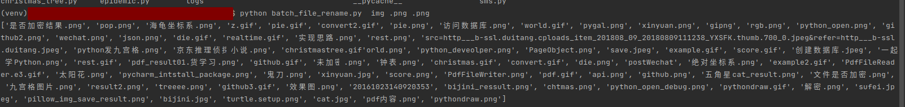

#! https://zhuanlan.zhihu.com/p/367299550


<!--
 * @Author: your name
 * @Date: 2021-04-23 16:13:29
 * @LastEditTime: 2021-04-23 18:00:27
 * @LastEditors: Please set LastEditors
 * @Description: In User Settings Edit
 * @FilePath: /Python_script/docs/批量给文件重命名.md
-->
Python批量修改文件名
----
python 对文件进行批量改名用到的是 os 模块中的 listdir 方法和 rename 方法。

- os.listdir(dir) : 获取指定目录下的所有子目录和文件名
- os.rename(原文件名，新文件名） : 对文件或目录改名

把混乱的文件名改成有序的文件名:
```python
import os
path=input('请输入文件路径(结尾加上/)：')       

#获取该目录下所有文件，存入列表中
fileList=os.listdir(path)

n=0
for i in fileist:
    
    #设置旧文件名（就是路径+文件名）
    oldname=path+ os.sep + fileList[n]   # os.sep添加系统分隔符
    
    #设置新文件名
    newname=path + os.sep +'a'+str(n+1)+'.JPG'
    
    os.rename(oldname,newname)   #用os模块中的rename方法对文件改名
    print(oldname,'======>',newname)
    
    n+=1
```


这样代码太简陋了，我们把需要修改下，　让我们能够传入参数, 支持:

- 自定义文件夹
- 自定义旧文件扩展名
- 自定义新文件扩展名

# 代码

```

"""
This will batch rename a group of files in a given directory,
once you pass the current and new extensions
"""

import argparse
import os


def batch_rename(dir, old_ext, new_ext):
    """
    This will batch rename a group of files in a given directory,
    once you pass the current and new extensions
    :param dir:
    :param old_ext:
    :param new_ext:
    :return:
    """
    files = os.listdir(dir)
    print(files)


def get_parser():
    parser = argparse.ArgumentParser(description='change extension of files in a working directory')
    parser.add_argument('dir', metavar='DIR', type=str, nargs=1, help='the directory where to change extension')
    parser.add_argument('old_ext', metavar='OLD_EXT', type=str, nargs=1, help='old extension')
    parser.add_argument('new_ext', metavar='NEW_EXT', type=str, nargs=1, help='new extension')
    return parser


def main():
    """
    This will be called if the script is directly invoked
    :return:
    """
    # adding command line argument
    parser = get_parser()
    args = vars(parser.parse_args())

    # Set the variable `dir` with the first argument passed
    dir = args['dir'][0]
    # Set the variable old_ext with the second argument passed
    old_ext = args['old_ext'][0]
    if old_ext and old_ext[0] != '.':
        old_ext = '.' + old_ext
    # Set the variable new_ext with the third argument passed
    new_ext = args['new_ext'][0]
    if new_ext and new_ext[0] != '.':
        new_ext = '.' + new_ext

    batch_rename(dir, old_ext, new_ext)


if __name__ == '__main__':
    main()

```

以上主要实现的是读取命令行的参数，　我们跑起来看下:


```python
 files = os.listdir(dir)
    print(files)
```

这里用的img文件夹，返回的是一组数组　


)

我们现在要完成批量给文件夹下文件改名的操作, batch_rename函数:

```python
def batch_rename(work_dir, old_ext, new_ext):
    """
    This will batch rename a group of files in a given directory,
    once you pass the current and new extensions
    """
    # files = os.listdir(work_dir)
    for filename in os.listdir(work_dir):
        # Get the file extension
        split_file = os.path.splitext(filename)
        # Unpack tuple element
        root_name, file_ext = split_file
        # Start of the logic to check the file extensions, if old_ext = file_ext
        if old_ext == file_ext:
            # Returns changed name of the file with new extention
            newfile = root_name + new_ext

            # Write the files
            os.rename(
                os.path.join(work_dir, filename),
                os.path.join(work_dir, newfile)
            )
    print("rename is done!")
    print(os.listdir(work_dir))


```
<b>全部代码</b>

```python
"""
This will batch rename a group of files in a given directory,
once you pass the current and new extensions
"""

import argparse
import os


def batch_rename(dir, old_ext, new_ext):
    """
    This will batch rename a group of files in a given directory,
    once you pass the current and new extensions
    :param dir:
    :param old_ext:
    :param new_ext:
    :return:
    """
    files = os.listdir(dir)
    # print(files)
    for filename in os.listdir(dir):
        # Get the file extension
        # 返回的是是 tulple类型的　([文件名], [文件扩展名])
        splite_file = os.path.splitext(filename)
        print(splite_file)
        # Unpack tuple element
        root_name, file_ext = splite_file
        # Start of the logic to check the file extensions, if old_ext = file_ext
        if old_ext == file_ext:
            # Returns changed name of the file with new extention
            newfile = root_name + new_ext

            #  Write the file
            os.rename(
                os.path.join(dir, filename),
                os.path.join(dir, newfile)
            )

            print("rename is done!")
            print(os.listdir(dir))

def get_parser():
    parser = argparse.ArgumentParser(description='change extension of files in a working directory')
    parser.add_argument('dir', metavar='DIR', type=str, nargs=1, help='the directory where to change extension')
    parser.add_argument('old_ext', metavar='OLD_EXT', type=str, nargs=1, help='old extension')
    parser.add_argument('new_ext', metavar='NEW_EXT', type=str, nargs=1, help='new extension')
    return parser


def main():
    """
    This will be called if the script is directly invoked
    :return:
    """
    # adding command line argument
    parser = get_parser()
    args = vars(parser.parse_args())

    # Set the variable `dir` with the first argument passed
    dir = args['dir'][0]
    # Set the variable old_ext with the second argument passed
    old_ext = args['old_ext'][0]
    if old_ext and old_ext[0] != '.':
        old_ext = '.' + old_ext
    # Set the variable new_ext with the third argument passed
    new_ext = args['new_ext'][0]
    if new_ext and new_ext[0] != '.':
        new_ext = '.' + new_ext

    batch_rename(dir, old_ext, new_ext)


if __name__ == '__main__':
    main()

```

## 思考
这里我们是批量修改了后缀名, 而且是保存在了原文件夹下，
如果我想放到新文件夹下呢？

提示使用:
- os.path.exists(path) 判断一个目录是否存在

- os.makedirs(path) 多层创建目录

- os.mkdir(path) 创建目录

可以参考这段代码：

```python
def mkdir(path):
    # 引入模块
    import os
 
    # 去除首位空格
    path=path.strip()
    # 去除尾部 \ 符号
    path=path.rstrip("\\")
 
    # 判断路径是否存在
    # 存在     True
    # 不存在   False
    isExists=os.path.exists(path)
 
    # 判断结果
    if not isExists:
        # 如果不存在则创建目录
        　# 创建目录操作函数
        os.makedirs(path) 
 
        print path+' 创建成功'
        return True
    else:
        # 如果目录存在则不创建，并提示目录已存在
        print path+' 目录已存在'
        return False
 
# 定义要创建的目录
mkpath="d:\\qttc\\web\\"
# 调用函数
mkdir(mkpath)
```

DEMO的函数里，我并没有使用os.mkdir(path)函数，而是使用了多层创建目录函数os.makedirs(path)。这两个函数之间最大的区别是当父目录不存在的时候os.mkdir(path)不会创建，os.makedirs(path)则会创建父目录。

比如：例子中我要创建的目录web位于D盘的qttc目录下，然而我D盘下没有qttc父目录，如果使用os.mkdir(path)函数就会提示我目标路径不存在，但使用os.makedirs(path)会自动帮我创建父目录qttc，请在qttc目录下创建子目录web。

## Python vars() 函数
>vars() 函数返回对象object的属性和属性值的字典对象。
> The vars() function returns the __dict__ attribute of the given object.

vars() 函数<b>语法</b>：
```python
vars(object)
```
<b>参数</b>:
- object -- 对象

<b>返回值</b>:
- 返回对象object的属性和属性值的字典对象，如果没有参数，就打印当前调用位置的属性和属性值 类似 locals()。