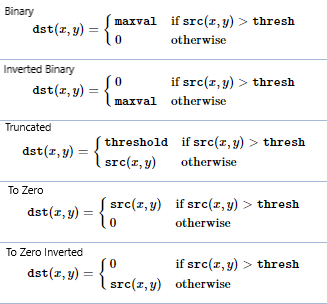
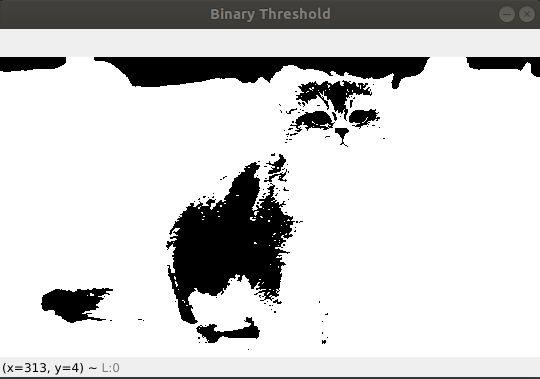

# Python使用 OpenCV 阈值处理

阈值是 OpenCV 中的一种技术，它是相对于提供的阈值分配像素值,在阈值处理中，将每个像素值与阈值进行比较。
如果像素值小于阈值设置为0，否则设置为最大值（一般为255）。阈值是一种非常流行的分割技术
用于将被视为前景的对象与其背景分开,阈值是在其任一侧具有两个区域的值，即低于阈值或高于阈值。

在计算机视觉中，这种阈值技术是在灰度图像上完成的,用于将被视为前景的对象与其背景分开,阈值是在其任一侧具有两个区域的值，即低于阈值或高于阈值。在计算机视觉中，这种阈值技术是在灰度图像上完成的,


- 阈值处理: 指剔除图像内像素值高于一定值或者低于一定值的像素点
  - OpenCV提供了cv2.threshold()和cv2.adaptiveThreshold用于实现阈值处理
  - 
```
If f (x, y) < T 
   then f (x, y) = 0 
else 
   f (x, y) = 255

where 
f (x, y) = Coordinate Pixel Value
T = Threshold Value.****
```

OpenCV 中，函数 cv2.threshold 用于阈值处理。

## 二进制阈值(Binary Thresholding)
像素值小于阈值，则设置为0，否则设置为最大值。像素值小于阈值，则设置为0，否则设置为最大值。

```
Syntax: cv2.threshold(source, thresholdValue, maxVal, thresholdingTechnique) 
Parameters: 
-> source: Input Image array (must be in Grayscale). 
-> thresholdValue: Value of Threshold below and above which pixel values will change accordingly. 
-> maxVal: Maximum value that can be assigned to a pixel. 
-> thresholdingTechnique: The type of thresholding to be applied. 
```

-  source : 第一个参数是源图像(这应该是一个灰度图像)
- thresholdValue : 第二个参数是用于对像素值进行分类的阈值。
- maxVal : 第三个参数是分配给超过阈值的像素值的最大值。
- thresholdingTechnique: OpenCV 提供了不同类型的阈值，由函数的第四个参数给出。
  - 所有简单的阈值类型是：
  - cv.THRESH_BINARY : 如果像素强度大于设置的阈值，则值设置为 255，否则设置为 0（黑色）。
  - cv.THRESH_BINARY_INV :` cv2.THRESH_BINARY `的反转或相反的情况
  - cv.THRESH_TRUNC: 如果像素强度值大于阈值，则将其截断为阈值。像素值设置为与阈值相同。所有其他值保持不变。
  - cv.THRESH_TOZERO: 像素强度设置为0，对于所有像素强度，小于阈值。
  - cv.THRESH_TOZERO_INV:` cv2.THRESH_TOZERO `的反转或相反情况




<b> 比较不同的简单阈值类型:</b>


**code** : 
```python
import cv2
import numpy as np

from matplotlib import pyplot as plt

image_first = cv2.imread('./img/cat.jpg')

# cv2.cvtColor 应用于
# 应用参数的图像输入
# 将图像转换为灰度
img = cv2.cvtColor(image_first, cv2.COLOR_BGR2GRAY)

# 应用不同的阈值输入图像的技术
# 所有大于 120 的像素值都会设置为 255
ret, thresh1 = cv2.threshold(img, 120, 255, cv2.THRESH_BINARY)
ret, thresh2 = cv2.threshold(img, 120, 255, cv2.THRESH_BINARY_INV)
ret, thresh3 = cv2.threshold(img, 120, 255, cv2.THRESH_TRUNC)
ret, thresh4 = cv2.threshold(img, 120, 255, cv2.THRESH_TOZERO)
ret, thresh5 = cv2.threshold(img, 120, 255, cv2.THRESH_TOZERO_INV)

cv2.imshow('Binary Threshold', thresh1)
# cv2.imshow('Binary Threshold Inverted', thresh2)
# cv2.imshow('Truncated Threshold', thresh3)
# cv2.imshow('Set to 0', thresh4)
# cv2.imshow('Set to 0 Inverted', thresh5)


# 取消分配任何相关的内存使用
if cv2.waitKey(0) & 0xff == 27:
    cv2.destroyAllWindows()
```

**input**:


**output**:




# Reference 

[Opencv Image Thresholding](https://docs.opencv.org/4.x/d7/d4d/tutorial_py_thresholding.html)