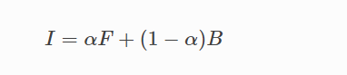
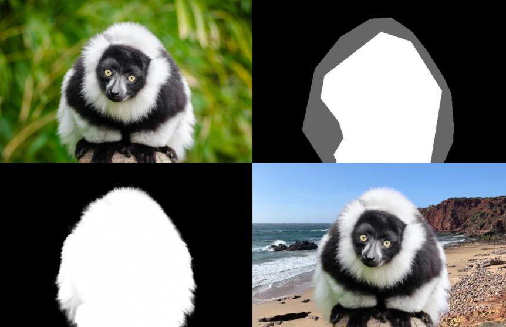
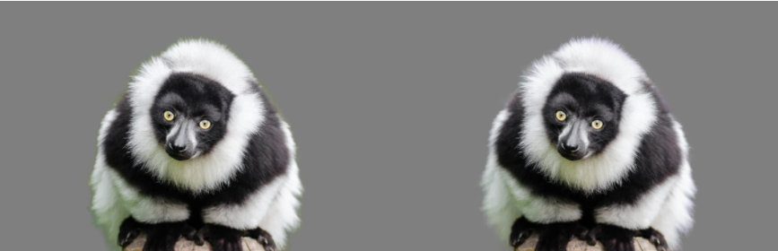

**AI抠图的场景:**
> 给定一张图像，通过划定一个区域，AI 应当能够估计到划定区域内的前景图目标，并将这个前景完整地抽取出来，用来替换到其他背景的图像中去, 这就是图像抠图
> 因此，抠图需要两个 AI 能力：首先，AI 需要能够在划定的区域内识别目标。其次，AI 要能够完整地将目标抽取出来，没有划定错误的边缘、模糊的图像等问题。

图像抠图是提取精确的 alpha 遮罩的过程，它将图像中的前景和背景对象分开。
这种技术传统上用于电影制作和摄影行业的图像和视频编辑目的，例如:背景替换、合成散景等视觉效果。

图像抠图假设图像是前景和背景图像的合成，因此,
每个像素的强度是前景和背景的线性组合

# 阿尔法抠图(Alpha Matting)

在传统图像分割的情况下，图像以二进制方式分割，其中像素属于前景或背景
然而，这种类型的分割无法处理包含精细细节的自然场景，
例如头发和毛皮，这需要为前景对象的每个像素估计透明度值。
与分割蒙版不同，Alpha Matting 通常非常精确，可保留股线级别的头发细节和准确的前景边界

虽然最近的深度学习技术已经显示出它们在图像抠图方面的潜力，但仍然存在许多挑战
但还有很多挑战， 如生成准确的地面实况 alpha抠图

改进对野外图像的泛化，并在处理高分辨率图像的移动设备上执行推理

对于具有前景像素 F 和背景 B 的图像 I，alpha 抠图问题旨在确定不透明度 α，使得等式

在估计了 alpha matte α 之后，可以估计前景像素和背景像素。我们将此过程称为前景估计。

四张图分别是： 
- 输入图像： 给定一只动物的图像
- 输入 trimap：人为划定的区域
- 估计的 alpha ： 算法应当能够获得划定区域内目标的阿尔法通道，即区分前景和背景的黑白轮廓
- 提取的前景： 有了这一数据，就可以从原图中抠去目标，并移动到新的图像中去

# PyMatting

**为了估计 alpha 遮罩，Pymatting 实现了以下抠图方法：**
- 封闭式抠图 Closed-form matting [LLW07] 
- KNN抠图 KNN matting [CLT13] 
- 大核抠图 Large kernel matting [HST10] 
- 基于学习的数字抠图 Learning-based Digital Matting [ZK09] 
- 随机漫步抠图  Random-walk matting[GSAW05]

## 前景提取
简单地将 alpha 遮罩与输入图像相乘会产生光晕伪影。这激发了前景提取方法的发展

输入图像简单地合成到灰色背景（左）和提取的前景放置到相同的背景（右）

PyMatting 中实现了以下前景估计方法：

- 封闭式前景估计  Closed-form foreground estimation[LLW07] 
- 多级别前景预估 （基于 CPU、CUDA 和 OpenCL 等）算法 Multilevel approach[GUCH20]

## 其他

项目还可以进行快速多线程 KNN 搜索、不完全阈值化楚列斯基分解（incomplete thresholded Cholesky decomposition）、V 轮几何多网格预条件子（V-Cycle Geometric Multigrid preconditioner）等

# 使用方法 
在使用前，你需要保证电脑安装相应的 Python 环境（Python 3），同时需要以下安装包：

- numpy>=1.16.0
- pillow>=5.2.0
- numba>=0.47.0
- scipy>=1.1.0

由于项目需要 GPU，因此也需要 GPU 相关支持：

- cupy-cuda90>=6.5.0 or similar
- pyopencl>=2019.1.2

除此之外，为了进行测试，也需要：

- pytest>=5.3.4

# Reference
- [Accurate Alpha Matting for Portrait Mode Selfies on Pixel 6](https://ai.googleblog.com/2022/01/accurate-alpha-matting-for-portrait.html)
- [PyMatting: A Python Library for Alpha Matting](https://github.com/pymatting/pymatting)