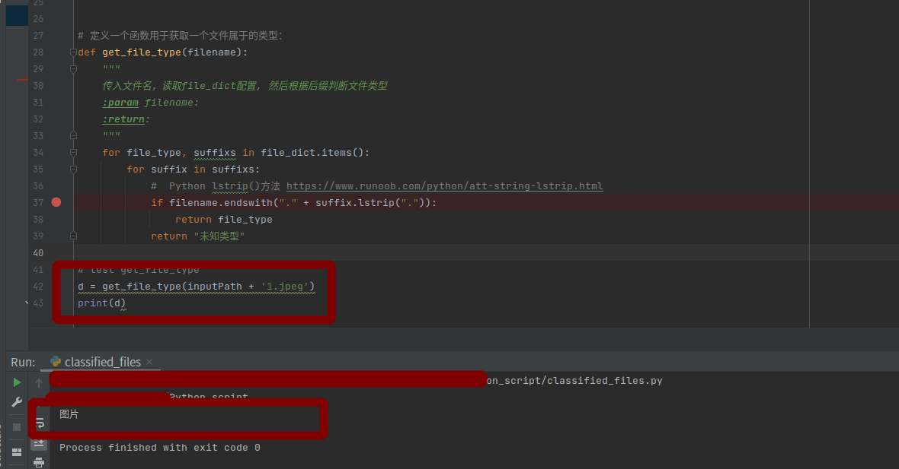

<!-- TOC -->
* [Python如何实现文件自动归类](#python)
  * [重要说明](#)
  * [1.1 任务介绍](#11-)
  * [1.2 知识点](#12-)
  * [1.3 环境](#13-)
  * [1.4 核心逻辑开发](#14-)
<!-- TOC -->

# Python如何实现文件自动归类


**面向人群**: 零基础或者初学者

**难度**: 简单， 属于Python基础课程

## 重要说明
我们尽力保证课程内容的质量以及学习难度的合理性，但即使如此，真正决定课程效果的，还是你的每一次思考和实践。

课程多数题目的解决方案都不是唯一的，这和我们在实际工作中的情况也是一致的。因此，我们的要求功能的实现，更是要多去思考不同的解决方案，评估不同方案的优劣，然后使用在该场景下最优雅的方式去实现。所以，我们列出的参考资料未必是实现需求所必须的。有的时候，实现题目的要求很简单，甚至参考资料里就有，但是背后的思考和亲手去实践却是任务最关键的一部分。在学习这些资料时，要多思考，多提问，多质疑。相信通过和小伙伴们的交流，能让你的学习事半功倍。
## 1.1 任务介绍

我们经常会手动的把文件归类到不同的文件夹下，但是如果文件特别多时候我们一个个归类是很麻烦的时期，这时候就可以用python脚本进行自动化归类。
下面我们就实现此任务

我们可以拆解下看涉及哪些问题:

- 如何移动文件? 
  -  使用内置模块shutil.move
- 归类的具体规则是什么?
  - 手动预设文件夹（文件种类不确定情况不符合）
  - 自动创建文件夹(以找到的文件的后缀来命名文件夹)
    - 定义一个函数用于获取一个文件属于的类型
    - 


## 1.2 知识点
- Linux命令行的使用
- Python语法基础
- os模块
- shutil模块 : 此模块包含了很多复制、删除、移动、等文件操作 https://docs.python.org/3/library/shutil.html
## 1.3 环境
- linux系统(ubuntu18.04)/ windows系统可以打开ubuntu子系统
- pycharm编辑器(windows如何安装pycharm社区版本)
- Python 3.6.9(windows如何安装python环境)
- pip3 9.0.1

## 1.4 核心逻辑开发

首先定义分类字典：

```python
file_dict = {

'图片': ["jpeg", 'jpg', 'png', 'gif', 'webp', "bmp", "bpg", "svg", "heif", "psd"],
'视频': ['rmvb', 'mp4', 'avi', 'mkv', 'flv', "wmv", "mov", "mpg", "mpeg", "3gp"],
"音频": ['m4a', 'aac', 'ogg', 'oga', 'mp3', 'wma', "wav"],
"电子书": ['pdf', "epub", "mobi", "azw3", "chm", "txt"],
"数据与表格": ['xls', 'xlsx', "xlsm", 'csv', 'json', 'xml'],
"文档": ['doc', 'docx', 'ppt', 'pptx', 'md', ".txt"],
"思维导图": ["emmx", "mmap", "xmind"],
'程序脚本': ['py', 'java', 'html', 'sql', 'r', 'css', 'cpp', 'c', 'js', 'go'],
'压缩文件': ["tar", "gz", "rz", "7z", "dmg", "rar", "xar", "zip", "iso"],
'可执行程序': ['exe', 'bat', 'sys', 'com'],
'字体文件': ['eot', 'otf', 'fon', 'font', 'ttf', 'ttc', 'woff', 'woff2']
}
```

然后定义一个函数用于获取一个文件属于的类型, 并测试下

```python
# 定义一个函数用于获取一个文件属于的类型：
def get_file_type(filename):
    """
    传入文件名，读取file_dict配置, 然后根据后缀判断文件类型
    :param filename:
    :return:
    """
    # print(file_dict.items())
    for file_type, suffixs in file_dict.items():
        for suffix in suffixs:
            #  Python lstrip()方法 https://www.runoob.com/python/att-string-lstrip.html
            if filename.endswith("."+suffix.lstrip(".")):
                return file_type
    return "未知类型"
```


使用pathlib库保存移动信息,获取了给定文件路径下的所有文件地址

```python
# 使用pathlib库保存移动信息：

def mkdirAndGeyChange(path) -> object:
    path = Path(path)
    result = []
    # 将文件以glob二进制读取
    for file in path.glob("*"):
        if file.is_dir():
            continue

        src_path = file.absolute()
        dest_dir = get_file_type(file.name)
        dest_path = path / dest_dir / file.name
        dest_dir = dest_path.parent

        if not dest_dir.exists():
            dest_dir.mkdir()
        result.append((src_path, dest_path))
    return result


# test

file_changes = mkdirAndGeyChange(inputPath)
print(file_changes)

```

```python
[(PosixPath('/home/mi/personal/Python_script/data/originfiles/kan.gif'), PosixPath('/home/mi/personal/Python_script/data/originfiles/图片/kan.gif')), (PosixPath('/home/mi/personal/Python_script/data/originfiles/1.jpeg'), PosixPath('/home/mi/personal/Python_script/data/originfiles/图片/1.jpeg')), (PosixPath('/home/mi/personal/Python_script/data/originfiles/3.jpeg'), PosixPath('/home/mi/personal/Python_script/data/originfiles/图片/3.jpeg')), (PosixPath('/home/mi/personal/Python_script/data/originfiles/拖放的文本.txt'), PosixPath('/home/mi/personal/Python_script/data/originfiles/电子书/拖放的文本.txt')), (PosixPath('/home/mi/personal/Python_script/data/originfiles/2.jpeg'), PosixPath('/home/mi/personal/Python_script/data/originfiles/图片/2.jpeg')), (PosixPath('/home/mi/personal/Python_script/data/originfiles/柚子编程logo.pdf'), PosixPath('/home/mi/personal/Python_script/data/originfiles/电子书/柚子编程logo.pdf'))]

Process finished with exit code 0
```


后面就是调用，需要改名时：

```python

```

