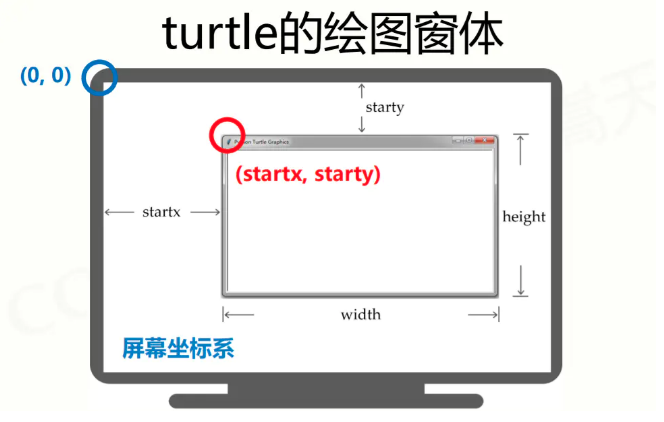
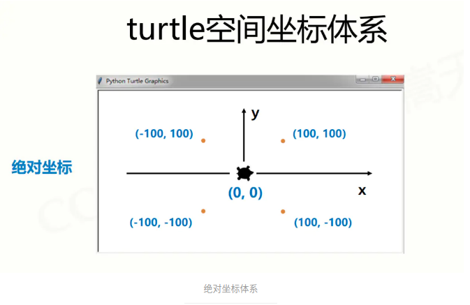
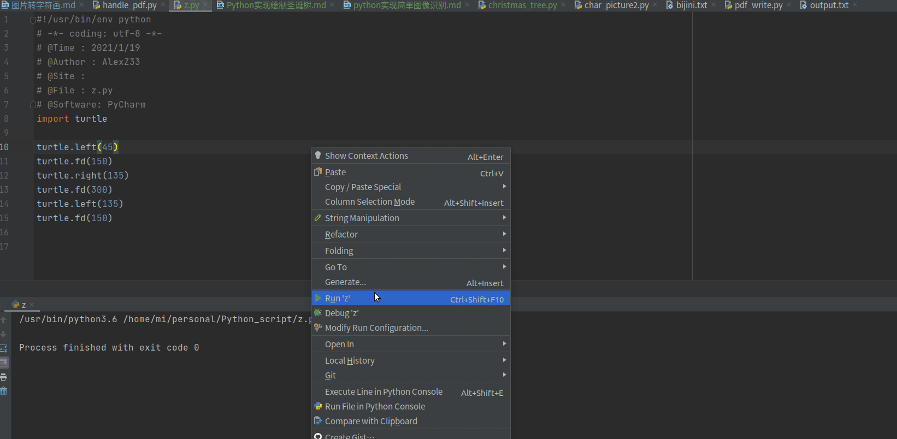
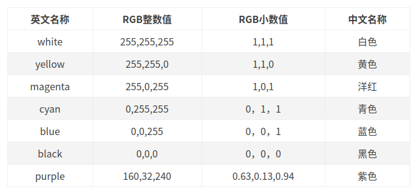
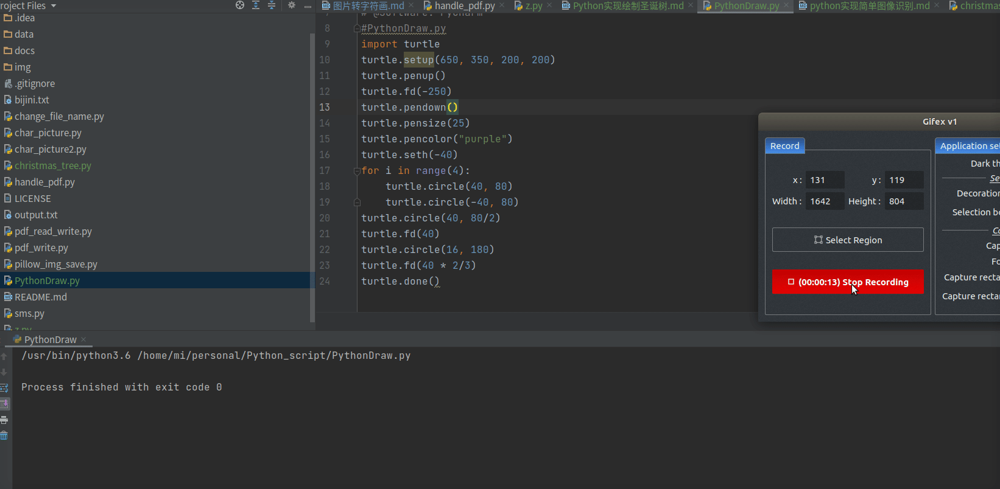
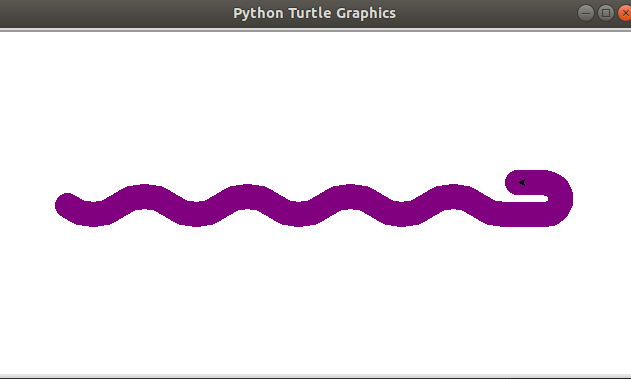
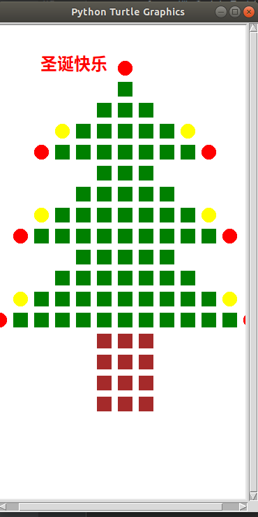
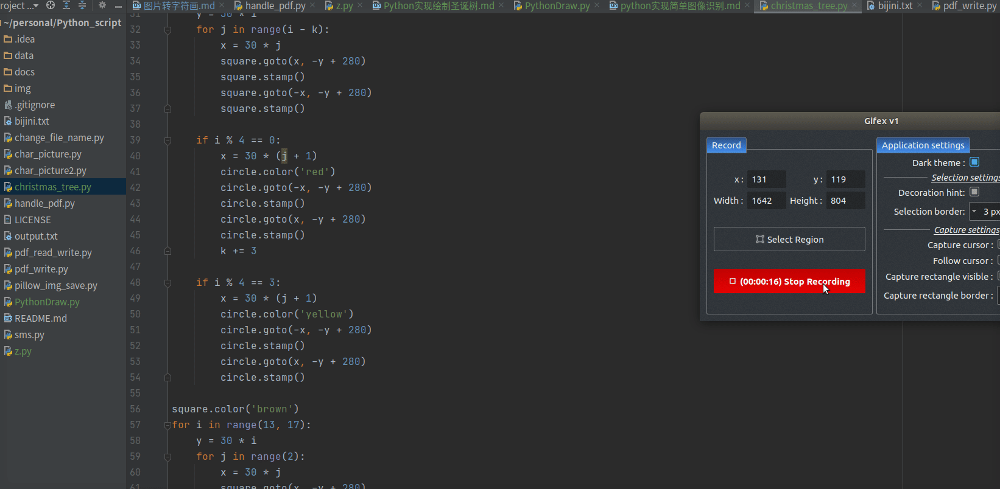
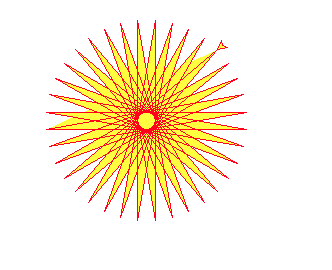
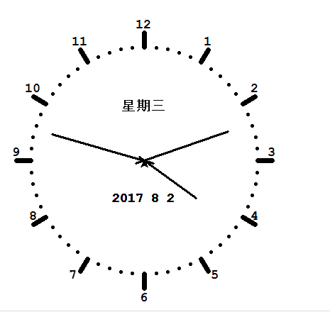

 图片转字符画

公众号原文阅读: [Python实现绘制圣诞树](https://mp.weixin.qq.com/s?__biz=MzkyMjE4NTA4OQ==&mid=2247484073&idx=1&sn=f0d0020eaa655ecf5ba5a29e844ea5f0&chksm=c1f97e47f68ef7517479c2353ca4a47424b0a5437e0a3ad9250fbf2d6f765d0ea91f5b795a5c&token=1665462260&lang=zh_CN#rd)

**面向人群**: 零基础或者初学者

**难度**: 简单， 属于Python基础课程

## 重要说明
我们尽力保证课程内容的质量以及学习难度的合理性，但即使如此，真正决定课程效果的，还是你的每一次思考和实践。

课程多数题目的解决方案都不是唯一的，这和我们在实际工作中的情况也是一致的。因此，我们的要求功能的实现，更是要多去思考不同的解决方案，评估不同方案的优劣，然后使用在该场景下最优雅的方式去实现。所以，我们列出的参考资料未必是实现需求所必须的。有的时候，实现题目的要求很简单，甚至参考资料里就有，但是背后的思考和亲手去实践却是任务最关键的一部分。在学习这些资料时，要多思考，多提问，多质疑。相信通过和小伙伴们的交流，能让你的学习事半功倍。
## 1.1 任务介绍
我们将用Python程序绘制一个圣诞树
## 1.2 知识点
- Linux命令行的使用
- Python基础
- turtle库的使用 (turtle库是python的基础绘图库)
- 官方手册: https://docs.python.org/2/library/turtle.html 
- https://docs.python.org/3/library/turtle.html
## 1.3 环境
- linux系统(ubuntu18.04)/ windows系统可以打开ubuntu子系统
- pycharm编辑器(windows如何安装pycharm社区版本)
- Python 3.6.9(windows如何安装python环境)
- pip3 9.0.1
- turtle 


```
$ python --version
Python 3.6.9

$ pip3 --version
pip 9.0.1 from /usr/lib/python3/dist-packages (python 3.6)

```
turtle名称含义为“海龟”，我们想象一只海龟，位于显示器上窗体的正中心，在画布上游走，它游走的轨迹就形成了绘制的图形。
海龟的运动是由程序控制的，它可以变换颜色，改变大小（宽度）等。

Ubuntu请安装python-tk或python3-tk，因为tk用的人不多所以Ubuntu的python包里没包括，需要自己手动安装。
```python
sudo apt-get install python3-tk
```
### 1.3.1关于turtle安装错误
提示错误：
```python
Collecting turtle
  Using cached https://files.pythonhosted.org/packages/ff/f0/21a42e9e424d24bdd0e509d5ed3c7dfb8f47d962d9c044dba903b0b4a26f/turtle-0.0.2.tar.gz
    Complete output from command python setup.py egg_info:
    Traceback (most recent call last):
      File "<string>", line 1, in <module>
      File "/tmp/pip-install-hpqxw6_s/turtle/setup.py", line 40
        except ValueError, ve:
                         ^
    SyntaxError: invalid syntax
 
    ----------------------------------------
Command "python setup.py egg_info" failed with error code 1 in /tmp/pip-install-hpqxw6_s/turtle/
```

解决的办法就是：按照给定的链接（我的是这个），把turtle包下载到本地，手动解压，修改setup.py文件再安装。

打开setup.py文件，第40行修改为
```
 except (ValueError, ve):
``` 
原来的是Python2的写法，没有括号，加了括号之后Python3就能用了。

用pip3安装修：
```
 pip install -e turtle-0.0.2
``` 
 
-e后面接上我们修改过setup.py文件的目录。

这样就搞定了。
另外，如果提示 python-tk 未安装，用apt命令安装就可以了：
```
sudo apt install python-tk
```

### 1.3.2 绘图窗体
`turtle.setup(width,height,startx,starty)`
使用turtle的setup函数，可以在屏幕中生成一个窗口（窗体），设置窗体的大小和位置，这个窗口就是画布的范围。
画布的最小单位是像素，屏幕的坐标系以左上角为原点（0，0）分布。



setup的四个参数分别指的是

- width：窗体的宽度
- height：窗体的高度
- startx:窗体距离屏幕边缘的左边像素距离
- starty:窗体距离屏幕上面边缘的像素距离

其中，后两个参数是可选项，如果不填写该参数，窗口会默认显示在屏幕的正中间。
setup()也是可选的，只是需要定义窗口的大小及位置是才使用。


### 1.3.3 turtle空间坐标体系

<b>绝对坐标</b>



可以使用`turtle.goto(x,y)`方法来让海龟沿着绝对坐标进行运动：

```python
import turtle

turtle.goto(100,100)
turtle.goto(100,-100)
turtle.goto(-100,-100)
turtle.goto(-100,100)
turtle.goto(0,0)
```

<b>海龟坐标</b>
是以海龟的视角的坐标体系，分为四个方向：
```python
turtle.fd(distance)   #前进
turtle.bk(distance)   #后退
turtle.rt(angle)      #右转
turtle.lt(angle)      #左转
```

<b>空间坐标系下绘图</b>

```python
import turtle 

turtle.left(45)
turtle.fd(150)
turtle.right(135)
turtle.fd(300)
turtle.left(135)
turtle.fd(150)
```

通过这几句可以在画布上实现一个斜着的Z字。



### 1.3.4 turtle角度坐标体系
绝对坐标体系下 有一个绝对角度体系

使用`turtle.seth()`方法改变海龟的朝向，但不运动

<b>海龟角度坐标</b>
海龟的角度坐标体系下，只分左转和右转两种情况。
使用以下方法来改变它的角度：

```python
turtle.left(angle) #向海龟左边改变运行方向
turtle.right(angle) #向海龟右边改变运行方向
```

### 1.3.5 RGB色彩体系
三种基础颜色：red green blue构成万物色。
能够覆盖视力能感知的所有颜色。
在计算机RGB色彩体系中，每个基础颜色的取值范围是0-255的整数，或0-1的小数

常用颜色：


使用turtle.colormode(mode)来调整海龟的颜色，默认采用RGB小数值，可以切换为整数值
- mode 小数值模式： 1.0
- mode 整数值模式： 255

### 1.3.6 turtle 函数介绍

<b>画笔控制函数</b>

画笔操作后一直有效，一般成对使用
```python
turtle.penup()  # turtle.pu()  抬起画笔，不再画线

turtle.pendown() # turtle.pd() 落下画笔，继续画线

```

画笔设置后一直有效，直到下次重新设置
```python
turtle.pensize(width)  # turtle.width(width)  设置画笔的宽度
turtle.pencolor(color) # color 为 色彩RGB值 设置画笔的颜色

# color参数 有三种形式
# 颜色字符串
turtle.pencolor('purple')  # 小写
# RGB小数值
turtle.pencolor(0.63,0.13,0.94) #三个小数值
# RGB数值元组  
turtle.pencolor((0.63,0.13,0.94))  # 一个三元素元组

```

<b>运动控制函数</b>
控制画笔的行进： 走直线&走曲线
```python
# 直线
turtle.forward(d)  # turtle.fd(d)   d为参数行进距离   控制画笔向前走d长度的直线  d可以为负数，表示向后运动

# 曲线
turtle.circle(r,extent=None) # 根据半径r绘制extent角度的弧形    r 默认圆心在画笔左端点距离r长度的地方  extent是绘制的角度，默认绘制完整的圆形
turtle.circle(100) # 在画笔的左侧（也就是上方）100距离的位置上然后以弧形来运动，没有设置extent参数，因此会绘制整个圆形
turtle.circle(-100,90) #圆心在画笔的右侧100距离（也就是下方）上，然后extent为90，因此绘制一个90度的弧形。
```

<b>运动控制函数</b>
控制画笔的行进： 走直线&走曲线
```python
# 直线
turtle.forward(d)  # turtle.fd(d)   d为参数行进距离   控制画笔向前走d长度的直线  d可以为负数，表示向后运动

# 曲线
turtle.circle(r,extent=None) # 根据半径r绘制extent角度的弧形    r 默认圆心在画笔左端点距离r长度的地方  extent是绘制的角度，默认绘制完整的圆形
turtle.circle(100) # 在画笔的左侧（也就是上方）100距离的位置上然后以弧形来运动，没有设置extent参数，因此会绘制整个圆形
turtle.circle(-100,90) #圆心在画笔的右侧100距离（也就是下方）上，然后extent为90，因此绘制一个90度的弧形。
```

<b>方向控制函数</b>
控制h画笔面对的方向：绝对角度 & 画笔角度
```python
# 绝对角度转向函数
turtle.setheading(angle)  # turtle.seth(angle)  改变画笔的面向的角度（ 初始方向是画布的正右方）  参数angle是绝对坐标系的角度    

#画笔角度转向函数
turtle.left(angle)  # 向左转angle度
turtle.right(angle) # 向右转angle度
```


方向控制函数只改方向，但是不会动，运动由运动控制函数实现。

熟悉以上这些，就能完成基本的绘图了

样例：

```python
#PythonDraw.py
import turtle
turtle.setup(650, 350, 200, 200)
turtle.penup()
turtle.fd(-250)
turtle.pendown()
turtle.pensize(25)
turtle.pencolor("purple")
turtle.seth(-40)
for i in range(4):
    turtle.circle(40, 80)
    turtle.circle(-40, 80)
turtle.circle(40, 80/2)
turtle.fd(40)
turtle.circle(16, 180)
turtle.fd(40 * 2/3)
turtle.done()
```



关于模块更多操作可以查看文档翻译版：
https://blog.csdn.net/weixin_41084236/article/details/82218431?utm_medium=distribute.pc_relevant.none-task-blog-BlogCommendFromMachineLearnPai2-4.control&depth_1-utm_source=distribute.pc_relevant.none-task-blog-BlogCommendFromMachineLearnPai2-4.control

## 1.4 代码

方法一:

```python
#!/usr/bin/env python
# -*- coding: utf-8 -*-
# @Time : 2021/1/19
# @Author : AlexZ33
# @Site : 
# @File : christmas_tree.py
# @Software: PyCharm

import turtle

screen = turtle.Screen()
screen.setup(375, 700)

circle = turtle.Turtle()
circle.shape('circle')
circle.color('red')
circle.speed('fastest')
circle.up()

square = turtle.Turtle()
square.shape('square')
square.color('green')
square.speed('fastest')
square.up()

circle.goto(0, 280)
circle.stamp()

k = 0
for i in range(1, 13):
    y = 30 * i
    for j in range(i - k):
        x = 30 * j
        square.goto(x, -y + 280)
        square.stamp()
        square.goto(-x, -y + 280)
        square.stamp()

    if i % 4 == 0:
        x = 30 * (j + 1)
        circle.color('red')
        circle.goto(-x, -y + 280)
        circle.stamp()
        circle.goto(x, -y + 280)
        circle.stamp()
        k += 3

    if i % 4 == 3:
        x = 30 * (j + 1)
        circle.color('yellow')
        circle.goto(-x, -y + 280)
        circle.stamp()
        circle.goto(x, -y + 280)
        circle.stamp()

square.color('brown')
for i in range(13, 17):
    y = 30 * i
    for j in range(2):
        x = 30 * j
        square.goto(x, -y + 280)
        square.stamp()
        square.goto(-x, -y + 280)
        square.stamp()

text = turtle.Turtle()
text.hideturtle()
text.penup()
text.goto(-120, 270)
text.color('red')
text.write('圣诞快乐', font=('SimHei', 18, 'bold'))
# 可以把【圣诞快乐】换成你的祝福语哦~」


```




<b>方法二<b>
```python
from turtle import *
import random
import time

n = 100.0

speed("fastest")
screensize(bg='seashell')
left(90)
forward(3 * n)
color("orange", "yellow")
begin_fill()
left(126)

for i in range(5):
    forward(n / 5)
    right(144)
    forward(n / 5)
    left(72)
end_fill()
right(126)

color("dark green")
backward(n * 4.8)


def tree(d, s):
    if d <= 0: return
    forward(s)
    tree(d - 1, s * .8)
    right(120)
    tree(d - 3, s * .5)
    right(120)
    tree(d - 3, s * .5)
    right(120)
    backward(s)


tree(15, n)
backward(n / 2)

for i in range(200):
    a = 200 - 400 * random.random()
    b = 10 - 20 * random.random()
    up()
    forward(b)
    left(90)
    forward(a)
    down()
    if random.randint(0, 1) == 0:
        color('tomato')
    else:
        color('wheat')
    circle(2)
    up()
    backward(a)
    right(90)
    backward(b)

time.sleep(60)
```

## 1.5 拓展： 绘制其他图形

### 1.5.1 太阳花

```python
# coding=utf-8
import turtle
import time
  
# 同时设置pencolor=color1, fillcolor=color2
turtle.color("red", "yellow")
  
turtle.begin_fill()
for _ in range(50):
turtle.forward(200)
turtle.left(170)
turtle.end_fill()
  
turtle.mainloop()
```

### 1.5.2 五角星

```python
# coding=utf-8
import turtle
import time
  
turtle.pensize(5)
turtle.pencolor("yellow")
turtle.fillcolor("red")
  
turtle.begin_fill()
for _ in range(5):
  turtle.forward(200)
  turtle.right(144)
turtle.end_fill()
time.sleep(2)
  
turtle.penup()
turtle.goto(-150,-120)
turtle.color("violet")
turtle.write("Done", font=('Arial', 40, 'normal'))
  
turtle.mainloop()
```


### 1.5.3 钟表
```python
# coding=utf-8
  
import turtle
from datetime import *
  
# 抬起画笔，向前运动一段距离放下
def Skip(step):
    turtle.penup()
    turtle.forward(step)
    turtle.pendown()
  
def mkHand(name, length):
    # 注册Turtle形状，建立表针Turtle
    turtle.reset()
    Skip(-length * 0.1)
    # 开始记录多边形的顶点。当前的乌龟位置是多边形的第一个顶点。
    turtle.begin_poly()
    turtle.forward(length * 1.1)
    # 停止记录多边形的顶点。当前的乌龟位置是多边形的最后一个顶点。将与第一个顶点相连。
    turtle.end_poly()
    # 返回最后记录的多边形。
    handForm = turtle.get_poly()
    turtle.register_shape(name, handForm)
  
def Init():
    global secHand, minHand, hurHand, printer
    # 重置Turtle指向北
    turtle.mode("logo")
    # 建立三个表针Turtle并初始化
    mkHand("secHand", 135)
    mkHand("minHand", 125)
    mkHand("hurHand", 90)
    secHand = turtle.Turtle()
    secHand.shape("secHand")
    minHand = turtle.Turtle()
    minHand.shape("minHand")
    hurHand = turtle.Turtle()
    hurHand.shape("hurHand")
    
    for hand in secHand, minHand, hurHand:
        hand.shapesize(1, 1, 3)
        hand.speed(0)
    
    # 建立输出文字Turtle
    printer = turtle.Turtle()
    # 隐藏画笔的turtle形状
    printer.hideturtle()
    printer.penup()
     
def SetupClock(radius):
    # 建立表的外框
    turtle.reset()
    turtle.pensize(7)
    for i in range(60):
        Skip(radius)
        if i % 5 == 0:
            turtle.forward(20)
            Skip(-radius - 20)
            
            Skip(radius + 20)
            if i == 0:
                turtle.write(int(12), align="center", font=("Courier", 14, "bold"))
            elif i == 30:
                Skip(25)
                turtle.write(int(i/5), align="center", font=("Courier", 14, "bold"))
                Skip(-25)
            elif (i == 25 or i == 35):
                Skip(20)
                turtle.write(int(i/5), align="center", font=("Courier", 14, "bold"))
                Skip(-20)
            else:
                turtle.write(int(i/5), align="center", font=("Courier", 14, "bold"))
            Skip(-radius - 20)
        else:
            turtle.dot(5)
            Skip(-radius)
        turtle.right(6)
         
def Week(t):  
    week = ["星期一", "星期二", "星期三",
            "星期四", "星期五", "星期六", "星期日"]
    return week[t.weekday()]
  
def Date(t):
    y = t.year
    m = t.month
    d = t.day
    return "%s %d%d" % (y, m, d)
  
def Tick():
    # 绘制表针的动态显示
    t = datetime.today()
    second = t.second + t.microsecond * 0.000001
    minute = t.minute + second / 60.0
    hour = t.hour + minute / 60.0
    secHand.setheading(6 * second)
    minHand.setheading(6 * minute)
    hurHand.setheading(30 * hour)
     
    turtle.tracer(False)
    printer.forward(65)
    printer.write(Week(t), align="center",
                  font=("Courier", 14, "bold"))
    printer.back(130)
    printer.write(Date(t), align="center",
                  font=("Courier", 14, "bold"))
    printer.home()
    turtle.tracer(True)
  
    # 100ms后继续调用tick
    turtle.ontimer(Tick, 100)
  
def main():
    # 打开/关闭龟动画，并为更新图纸设置延迟。
    turtle.tracer(False)
    Init()
    SetupClock(160)
    turtle.tracer(True)
    Tick()
    turtle.mainloop()
  
if __name__ == "__main__":
    main()
```


----------------
# 联系我们
