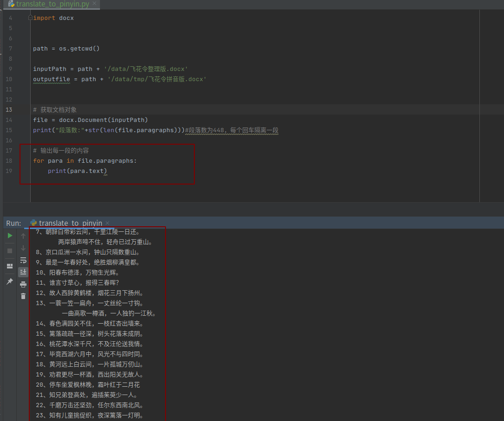

#! https://zhuanlan.zhihu.com/p/368053324
<!--
 * @Author: your name
 * @Date: 2021-04-26 10:32:29
 * @LastEditTime: 2021-04-26 19:42:31
 * @LastEditors: Please set LastEditors
 * @Description: In User Settings Edit
 * @FilePath: /Python_script/docs/Python读取word文本并将中文翻译成拼音.md
-->

<!-- TOC -->
* [需求背景](#)
* [使用python-docx读取word文本](#python-docxword)
* [使用pypinyin中文转拼音](#pypinyin)
  * [基本拼音](#)
  * [风格转换](#)
* [代码](#)
* [结语](#)
<!-- TOC -->

# 需求背景
不知到大家最近有没刷剧，鲸鱼最近刷了部剧叫《小舍得》，里面各种家庭伦理大剧, 剧情之狗血让人无力吐槽。


不过吐槽归吐槽，这里面给人印象最深刻的就是中产阶级一代对于<b>育儿的焦虑</b>。尤其是小孩的教育问题。


这不，有朋友就因为小孩<b>家庭作业</b>问题求助到了鲸鱼这。


我们来看看具体需求：


原来老师布置给48首飞花令注上拼音！　哎呀，我去这居然是一年级小朋友的作业，　这里面多少诗很多人都不认识吧？！何况量还不少。
小朋友和家长得写一晚上吧。

我这把拼音忘到姥姥家的朋友更不用提了。

不过他灵机一动想到了求助我用代码解决（真机智啊－－）


那我们就打开word文档，来看看分析一下需求


- 我们需要能够读取并操作docx
- 我们要能够把中文转换成拼音

# 使用python-docx读取word文本
Python可以利用python-docx模块处理word文档，处理方式是面向对象的。也就是说python-docx模块会把word文档，文档中的段落、文本、字体等都看做对象，对对象进行处理就是对word文档的内容处理。
```python
# 在cmd命令或者terminal行中输入
pip install python-docx 
```
如果需要读取word文档中的文字（一般来说，程序也只需要认识word文档中的文字信息），需要先了解python-docx模块的几个概念。

- Document对象，表示一个word文档。
- Paragraph对象，表示word文档中的一个段落
- Paragraph对象的text属性，表示段落中的文本内容。

<b>读取word文本</b>




# 使用pypinyin中文转拼音

```python
# 安装：
pip install pypinyin
```


## 基本拼音


## 风格转换


```

#: 普通风格，不带声调。如： 中国 -> ``zhong guo``
NORMAL = 0
#: 标准声调风格，拼音声调在韵母第一个字母上（默认风格）。如： 中国 -> ``zhōng guó``
TONE = 1
#: 声调风格2，即拼音声调在各个韵母之后，用数字 [1-4] 进行表示。如： 中国 -> ``zho1ng guo2``
TONE2 = 2
#: 声调风格3，即拼音声调在各个拼音之后，用数字 [1-4] 进行表示。如： 中国 -> ``zhong1 guo2``
TONE3 = 8
#: 声母风格，只返回各个拼音的声母部分（注：有的拼音没有声母，详见 `#27`_）。如： 中国 -> ``zh g``
INITIALS = 3
#: 首字母风格，只返回拼音的首字母部分。如： 中国 -> ``z g``
FIRST_LETTER = 4
#: 韵母风格，只返回各个拼音的韵母部分，不带声调。如： 中国 -> ``ong uo``
FINALS = 5
#: 标准韵母风格，带声调，声调在韵母第一个字母上。如：中国 -> ``ōng uó``
FINALS_TONE = 6
#: 韵母风格2，带声调，声调在各个韵母之后，用数字 [1-4] 进行表示。如： 中国 -> ``o1ng uo2``
FINALS_TONE2 = 7
#: 韵母风格3，带声调，声调在各个拼音之后，用数字 [1-4] 进行表示。如： 中国 -> ``ong1 uo2``
FINALS_TONE3 = 9
#: 注音风格，带声调，阴平（第一声）不标。如： 中国 -> ``ㄓㄨㄥ ㄍㄨㄛˊ``
BOPOMOFO = 10
#: 注音风格，仅首字母。如： 中国 -> ``ㄓ ㄍ``
BOPOMOFO_FIRST = 11
#: 汉语拼音与俄语字母对照风格，声调在各个拼音之后，用数字 [1-4] 进行表示。如： 中国 -> ``чжун1 го2``
CYRILLIC = 12
#: 汉语拼音与俄语字母对照风格，仅首字母。如： 中国 -> ``ч г``
CYRILLIC_FIRST = 13
```


更多内容看这篇文章总结: https://cuiqingcai.com/6519.html

# 代码

```
'''
Author: AlexZ33
Date: 2021-04-26 09:42:02
LastEditTime: 2021-04-26 19:33:23
LastEditors: Please set LastEditors
Description: In User Settings Edit
FilePath: /Python_script/translate_to_pinyin.py
'''
# 读取docx中的文本并转化成拼音
import os
import re
import docx
import pypinyin

path = os.getcwd()

inputPath = path + '/data/飞花令整理版.docx'
outputfile = path + '/data/tmp/飞花令拼音版.docx'

if __name__ == "__main__":
    # 获取文档对象
    file = docx.Document(inputPath)
    print("段落数:" + str(len(file.paragraphs)))  # 段落数为448，每个回车隔离一段
    # 输出每一段的内容
    document = docx.Document()
    for p in file.paragraphs:
        txt = p.text


        # pinyin 方法默认使用了 TONE 的风格，而 lazy_pinyin 方法默认使用了 NORMAL 的风格，所以就导致二者返回风格不同了
        str = pypinyin.lazy_pinyin(txt, style='Style.TONE')
        split_str = str[1: -1]
        s = ''
        for i in split_str:

            s = s + ''.join(i) + " "

        print(txt)
        print(s)
        # document = docx.Document()

        document.add_paragraph(s)
        document.add_paragraph(txt)
    document.save(outputfile)

```
我们来看看结果:


完美注上拼音啦！　还有声调哦！


# 结语

现在孩子和家长都不容易啊！

