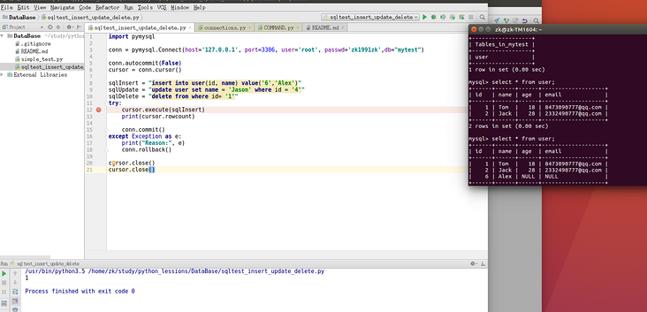
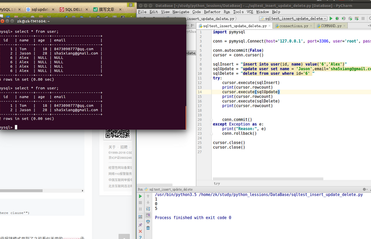

#! https://zhuanlan.zhihu.com/p/427043832
<!--
 * @Author: your name
 * @Date: 2021-10-29 09:45:55
 * @LastEditTime: 2021-10-29 09:56:47
 * @LastEditors: Please set LastEditors
 * @Description: In User Settings Edit
 * @FilePath: /Python_script/docs/Python连接操作数据库.md
-->

<!-- TOC -->
* [Python连接操作数据库](#python)
* [mysql](#mysql)
  * [更新数据库insert/update/delete](#insertupdatedelete)
* [mysql-connector](#mysql-connector)
  * [1、作用](#1)
  * [2、示例](#2)
* [示例](#)
* [注意点](#)
* [参考](#)
<!-- TOC -->
# Python连接操作数据库
# mysql
 python3中用`pymysql`操作mysql数据库

```
pip3 install PyMySQL
```


```
import pymysql
conn = pymysql.Connect(host='127.0.0.1',port=3306,user='root',passwd='zk1991zk',db='mytest',charset='utf8')
cursor = conn.cursor()
sql = "select * from  user"
cursor.execute(sql)
rs = cursor.fetchall()
print('rs:', rs)

for each in rs:
    print(each)


```

## 更新数据库insert/update/delete

不同于select操作，这三个操作修改了数据库内容，所以需要commit()，否则数据库没有做相应的更改，但是也不会报错。

```
import pymysql

conn = pymysql.Connect(host='127.0.0.1', port=3306, user='root', passwd='zk1991zk',db="mytest")

conn.autocommit(False)
cursor = conn.cursor()

sqlInsert = "insert into user(id, name) value('6','Alex')"
sqlUpdate = "update user set name = 'Jason',email='sha5xiang@gmail.com' where id = '2'"
sqlDelete = "delete from user where id='6' "
try:
    cursor.execute(sqlInsert)
    print(cursor.rowcount)
    cursor.execute(sqlUpdate)
    print(cursor.rowcount)
    cursor.execute(sqlDelete)
    print(cursor.rowcount)

    
    conn.commit()
except Exception as e:
    print("Reason:", e)
    conn.rollback()

cursor.close()
cursor.close()

```




# mysql-connector
安装：

```bash
pip install mysql-connector
```

## 1、作用

``mysql`` 模块的再包装，并支持 with语法。

将使用简化抽象为：

1. 连接数据库；
2. 执行sql语句并获得返回结果；
3. 关闭数据库（使用with的时候可以省略）；

## 2、示例

示例1（with语法）

```
# 连接数据库
with MySQLTool(user=user, password=pw, database=database) as m2:
    # 执行sql并获得返回结果
    result2 = m2.run_sql([
        ['insert person(name, age) values ("李四", 20), ("王五", 30)'],
        ['select * from person']
    ])
    # 打印结果
    print(result2)
```

示例2（普通语法）

```
m = MySQLTool()
# 查看mysql容器内 ip，参考这个链接：https://blog.csdn.net/CSDN_duomaomao/article/details/75638544
m.connect(user=user,
          password=pw,
          # host=ip,
          database=database)
result = m.run_sql([
    ['insert person(name,age) values (%s, %s)', ['六六六', 666]],
    ['select * from person']
])
print(result)
m.close()
```
# 示例
```
#!/usr/bin/env python3
# -*- coding: utf-8 -*-

import sys
from mysql import connector
from ..printcolor_lingling import print_testresult
import time

_user = ''
_password = ''
_database = ''
_host = '127.0.0.1'
_port = 3306
_unix_socket = None


def errlog(msg):
    with open('./log/mysql-err.log', 'a')as f:
        f.write('%s||%s：%s\n' % (
            time.strftime("%Y-%m-%d %H:%M:%S", time.localtime()),
            sys._getframe(1).f_code.co_name,  # 执行errlog这个函数的函数名字，即上一级函数
            msg
        ))


def sqllog(sql, args=[]):
    with open('./log/mysql.log', 'a')as f:
        f.write('%s||%s：%s\n' % (
            time.strftime("%Y-%m-%d %H:%M:%S", time.localtime()),
            sys._getframe(1).f_code.co_name,  # 执行errlog这个函数的函数名字，即上一级函数
            sql % tuple(args)
        ))


class MySQLTool(object):
    def __init__(self, **args):
        self.c = None
        self.cursor = None
        # 参数不足2个则直接扔掉，因为至少需要 root 和 password
        if not ('user' in args and 'password' in args):
            pass
        else:
            # 超过3个，取传的参数的值
            self.args = args

    # 连接到数据库，参数要么传值，要么使用默认值
    # 这里的默认值是从 mysql/connector/abstracts.py 复制来的
    def connect(self,
                user=_user,
                password=_password,
                database=_database,
                host=_host,
                port=_port,
                unix_socket=_unix_socket):
        self.c = connector.connect(user=user,
                                   password=password,
                                   database=database,
                                   host=host,
                                   port=port,
                                   unix_socket=unix_socket)
        self.cursor = self.c.cursor()

    # with 的时候执行，返回值是 with...as e 中的e的值
    def __enter__(self):
        self.connect(**self.args)
        return self

    # with 内部代码块执行完毕后执行
    def __exit__(self, exc_type, exc_value, traceback):
        if exc_type:
            print('Error')
        else:
            self.close()

    # 执行 SQL 语句，并返回最后一次查询的查询结果
    # 如果错误，返回False，其他时候返回结果
    # 适用于select时使用。建议insert和update使用专有函数
    def run_sql(self, sql_list):
        error = False
        try:
            # 依次执行 sql 语句
            for sql in sql_list:
                print('sql: %s', sql)
                if len(sql) == 1:
                    self.cursor.execute(sql[0])
                    sqllog(sql[0])
                else:
                    self.cursor.execute(*sql)
                    sqllog(sql[0], sql[1])
            # 这里如果报错，说明操作是比如 create table 之类的操作，返回 None
            result = self.cursor.fetchall()
        except BaseException as e:
            print(e)
            error = True
            errlog(str(e))
        finally:
            # 如果错误，返回False，其他时候返回结果
            if error:
                return False
            else:
                return result

    # 更新专用函数。
    # 错误返回False，未更新（比如说不需要更新）返回0，成功更新返回更新的行数，例如影响了2行数据就是2
    def update_row(self, sql, args):
        error = False
        change_rows = None
        try:
            self.cursor.execute(sql, args)
            sqllog(sql, args)
            # 判断一下影响了多少条数据，如果为0条，说明啥事都没干
            change_rows = self.get_cu_rowcount()
        except BaseException as e:
            print(e)
            error = True
            errlog(str(e))
        finally:
            # 如果错误，返回False，其他时候返回结果
            if error:
                return False
            else:
                return change_rows

    # 插入一行。
    # 插入失败（报错或无法插入）返回False，插入成功返回插入行的id
    def insert_row(self, sql, args):
        error = False
        try:
            # 正常情况下，返回值为None
            self.cursor.execute(sql, args)
            sqllog(sql, args)
            # 判断一下影响了多少条数据，如果为0条，说明啥事都没干
            change_rows = self.get_cu_rowcount()
            if change_rows == 0:
                error = True
        except BaseException as e:
            error = True
            msg = str(e)
            errlog(msg)
        finally:
            if error:
                return False
            else:
                return self.get_last_insert_id()

    # 同时插入多行（也可以只插入一行）
    # 如果插入错误/或未成功插入，会返回False
    # 插入成功，则返回插入的条数
    # 示例：m.insert_more_rows(
    #             'insert person(name,age) values (%s, %s)',
    #             [('六六六', 666)]
    #         )
    def insert_more_rows(self, sql, args):
        error = False
        change_rows = None
        try:
            # 正常情况下，返回值为None
            self.cursor.executemany(sql, args)
            sqllog(sql, args)
            # 判断一下影响了多少条数据，如果为0条，说明啥事都没干
            change_rows = self.get_cu_rowcount()
            if change_rows == 0:
                error = True
        except BaseException as e:
            error = True
            msg = str(e)
            errlog(msg)
        finally:
            if error:
                return False
            else:
                return change_rows

    # 返回 cursor
    def get_cursor(self):
        return self.cursor

    # 当上一次操作是插入或更新时，获取插入/更新影响的行数。比如插入一条就是一行
    # 如果是 -1，表示上一次操作不是插入
    def get_cu_rowcount(self):
        return self.cursor.rowcount

    # 获取上一个插入行的id（需要要插入后执行才能正确返回id，否则返回None）
    def get_last_insert_id(self):
        return self.cursor.lastrowid

    # 手动提交事务，部分场景下可能有用
    def commit(self):
        self.c.commit()

    # 关闭连接
    def close(self):
        self.cursor.close()
        self.c.commit()
        self.c.close()


# 测试代码和示例代码
# 以下代码的执行前提是本机有一个 mysql 的容器，这个容器参照这个链接
# https://github.com/qq20004604/docker-learning/tree/master/docker-demo-02-MySQL
if __name__ == '__main__':
    is_error = False
    try:
        # 测试数据
        user = 'docker'
        pw = '1654879wddgfg'
        database = 'docker_test_database'

        # ---- 测试代码2 ----
        # 连接数据库
        with MySQLTool(user=user, password=pw, database=database) as m2:
            # 执行sql并获得返回结果
            result2 = m2.run_sql([
                ['insert person(name, age) values ("李四", 20), ("王五", 30)'],
                ['select * from person']
            ])
            # 打印结果
            print(result2)

        print("——————————————————————")
        # ---- 测试代码1 ----
        m = MySQLTool()
        # 查看mysql容器内 ip，参考这个链接：https://blog.csdn.net/CSDN_duomaomao/article/details/75638544
        m.connect(user=user,
                  password=pw,
                  # host=ip,
                  database=database)
        result = m.insert_more_rows(
            'insert person(name,age) values (%s, %s)',
            [('六六六', 666)]
        )
        if result is False:
            is_error = True

        result2 = m.insert_row(
            'insert person(name,age) values (%s, %s)',
            ('六六六', 666)
        )
        if result is False:
            is_error = True

        m.close()
    except BaseException as e:
        print(e)
        is_error = True
    print_testresult(not is_error, 'MySQLTool')

```


下一章我们讲　`银行转账`实例的实现


# 注意点
- NoneType' object has no attribute 'encoding' ，之前指明的charset必须是"UTF8",不是"utf-8"/"UTF-8"
- MySQL语句后面必须有';'，否则不会报错，也难以发现
- 数据库insert/update/delete操作需要commit()
- 在构造命令的时候，注意用 " 包裹起来，因为SQL语句字符串需要 ' 包裹。所以，" 比较简单的避免歧义。

# 参考
[python3操作MySQL数据库](http://blog.csdn.net/e62ces0iem/article/details/73195451)
[Python3读取Excel数据存入MySQL]()


  [1]: /img/bV51DM
  [2]: /img/bV51D1
  [3]: /img/bV51Dk
  [4]: /img/bV539A
  [5]: /img/bV54bJ
  [6]: /img/bV54cB