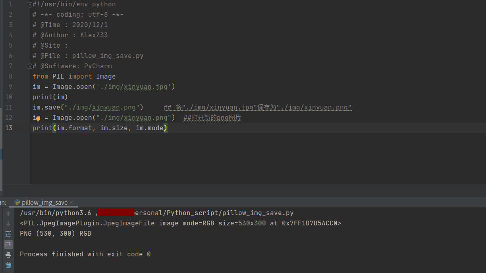

https://blog.csdn.net/zhangziju/article/details/79123275?utm_medium=distribute.pc_relevant.none-task-blog-BlogCommendFromMachineLearnPai2-2.control&depth_1-utm_source=distribute.pc_relevant.none-task-blog-BlogCommendFromMachineLearnPai2-2.control
## pillow的使用
- 文档：https://pillow.readthedocs.io/en/latest/index.html

### Image模块

Image模块是在Python PIL图像处理中常见的模块，对图像进行基础操作的功能基本都包含于此模块内。如open、save、conver、show…等功能。
#### open类

```python
Image.open(file) ⇒ image
Image.open(file, mode) ⇒ image
```
要从文件加载图像，使用 open() 函数， 在 Image 模块：

```python

    from PIL import Image             ##调用库
    im = Image.open("../img/xinyuan.jpeg")  ##文件存在的路径
    im.show() 
```


需要知道的是在win的环境下im.show的方式为win自带的图像显示应用。打开并确认给定的图像文件。这个是一个懒操作；该函数只会读文件头，而真实的图像数据直到试图处理该数据才会从文件读取（调用load()方法将强行加载图像数据）。如果变量mode被设置，那必须是“r”。用户可以使用一个字符串（表示文件名称的字符串）或者文件对象作为变量file的值。文件对象必须实现read()，seek()和tell()方法，并且以二进制模式打开。

#### Save类

```python
im.save(outfile,options…)
im.save(outfile, format, options…)
```
若要保存文件，则使用 Image 类的 save() 方法，此时保存文件的文件名就变得十分重要了，除非指定格式，否则这个库将会以文件名的扩展名作为格式保存。使用给定的文件名保存图像。如果变量format缺省，如果可能的话，则从文件名称的扩展名判断文件的格式。该方法返回为空。关键字options为文件编写器提供一些额外的指令。如果编写器不能识别某个选项，它将忽略它。用户可以使用文件对象代替文件名称。在这种情况下，用户必须指定文件格式。文件对象必须实现了seek()、tell()和write()方法，且其以二进制模式打开。如果方法save()因为某些原因失败，这个方法将产生一个异常（通常为IOError异常）。如果发生了异常，该方法也有可能已经创建了文件，并向文件写入了一些数据。如果需要的话，用户的应用程序可以删除这个不完整的文件。
`pillow_img_save.py`
```python
from PIL import Image
im = Image.open("../img/xinyuan.jpg")
print(im)
im.save("../img/xinyuan.png")     ## 将"../img/xinyuan.jpg"保存为"../img/xinyuan.png"
im = Image.open("../img/xinyuan.png")  ##打开新的png图片
print(im.format, im.size, im.mode)
```

如下图，在指定路径下可看到新保存的png格式的图片


#### format类
