# pypal数据可视化

**面向人群**: 初学者 和掌握一定python语法基础的同学

**难度**: 中级， 属于Python进阶课程

当涉及交互式图表和可以使用的模块时，您可能熟悉Matplotlib，Seaborn和Bokeh，它们各自允许交互并支持其他功能。 但是，Pygal专门允许用户创建SVG。 除了SVG的可扩展性之外，您还可以在任何编辑器中对其进行编辑，并以非常高质量的分辨率进行打印。 SVG格式也易于与Flask和Django集成。 最后，您可以使用很少的代码轻松而最少地创建折线图，条形图和雷达图（仅举几例），我们将在下面很快介绍

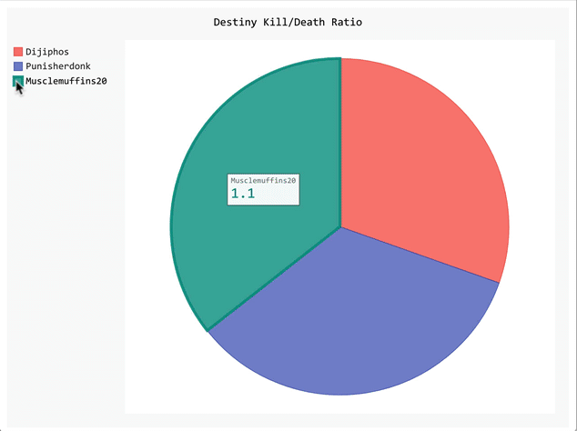
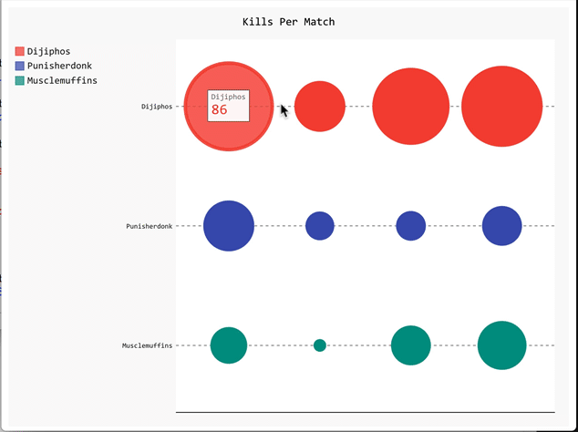
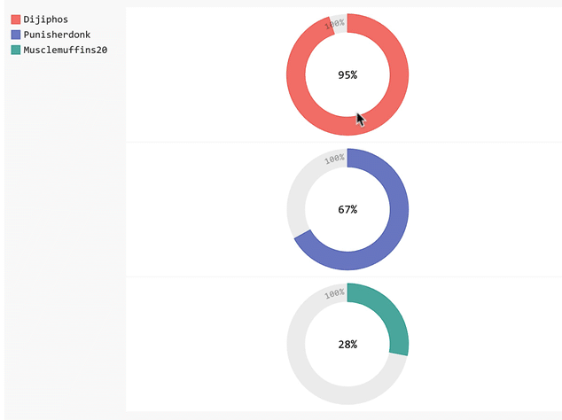

## 重要说明
我们尽力保证课程内容的质量以及学习难度的合理性，但即使如此，真正决定课程效果的，还是你的每一次思考和实践。

课程多数题目的解决方案都不是唯一的，这和我们在实际工作中的情况也是一致的。因此，我们的要求功能的实现，更是要多去思考不同的解决方案，评估不同方案的优劣，然后使用在该场景下最优雅的方式去实现。所以，我们列出的参考资料未必是实现需求所必须的。有的时候，实现题目的要求很简单，甚至参考资料里就有，但是背后的思考和亲手去实践却是任务最关键的一部分。在学习这些资料时，要多思考，多提问，多质疑。相信通过和小伙伴们的交流，能让你的学习事半功倍。
## 1.1 任务介绍
通过多个案例学习pypal的数据可视化, 包括
- 例子一:  利用饼图分析绘制图灵编程俱乐部学员各星座人数比例12星座的比例
- 例子二： 利用折线图分析希文小朋友，每科考试成绩趋势
- 例子三： 利用简单直方图展示掷骰子1000次6个面的出现次数  
- 例子四： 豆豆小朋友吃饭不知道吃什么？利用雷达图分析了一下周围餐厅的评分
- 例子五：可视化展示世界人口地图（处理json数据）  
- 例子六：利用github提供的接口，呈现GitHub上Python项目的受欢迎程度（使用Web API分析数据）

## 1.2 知识点
- Linux命令行的使用
- Python基础
- pygal库的使用

## 1.3 环境
- linux系统(ubuntu18.04)/ windows系统可以打开ubuntu子系统
- pycharm编辑器(windows如何安装pycharm社区版本)
- Python 3.6.9(windows如何安装python环境)
- pip3 9.0.1
- pypal
- requests
<b>安装Pygal</b>
```python
pip3 install pygal
```
安装requests
```python
pip3 install requests
```
<b>Step 1: Import</b>
```python
import pygal
```
<b>Step 2: 创建变量储存图形</b>

对于第一个示例，我们将创建一个饼图。 我们只需要创建一个变量并将`pygal.Pie()`存储在其中即可。
```python
import pygal
pie_chart = pygal.Pie()
```
<b>Step 3: 添加一些值到图形上</b>
## 1.4 实例练习
### 例子一
`sign_piechart.py`

```python
#!/usr/bin/env python
# -*- coding: utf-8 -*-
# @Time : 2021/1/20
# @Author : AlexZ33
# @Site : 
# @File : sign_piechart.py
# @Software: PyCharm
import pygal
pie_chart = pygal.Pie()
pie_chart.title = '图灵编程俱乐部学员各星座人数比例（%)'
pie_chart.add('天蝎', 15.74)
pie_chart.add('射手', 9.86)
pie_chart.add('双子', 9.97)
pie_chart.add('金牛', 9.31)
pie_chart.add('巨蟹', 9.27)
pie_chart.add('白羊', 8.66)
pie_chart.add('水瓶', 6.85)
pie_chart.add('狮子', 6.70)
pie_chart.add('双鱼', 6.40)
pie_chart.add('天秤', 6.31)
pie_chart.add('摩羯', 5.75)
pie_chart.add('处女', 5.36)
pie_chart.render()

pie_chart.render_in_browser()
```
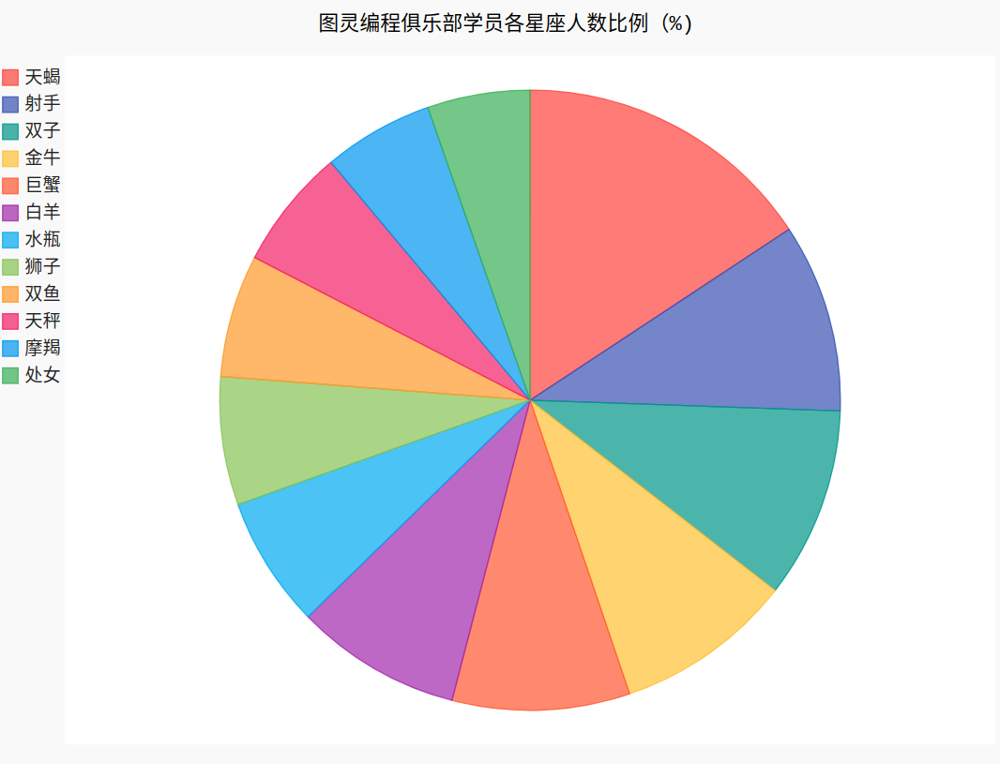
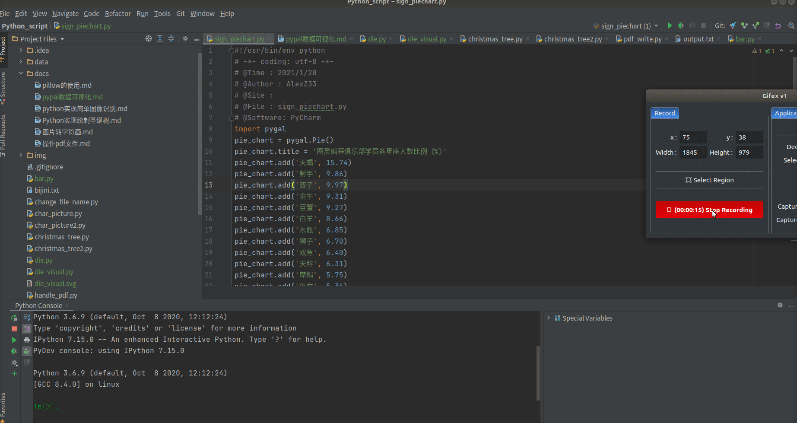

### 实例二
`score_linechart.py`
```python
#!/usr/bin/env python
# -*- coding: utf-8 -*-
# @Time : 2021/1/20
# @Author : AlexZ33
# @Site : 
# @File : score_linechart.py
# @Software: PyCharm
import pygal
line_chart = pygal.Line()
line_chart.title = '希文小朋友各科成绩趋势图'
line_chart.x_labels = map(str, range(1, 6))
# temp = map(str, range(1, 6))
# print(temp)
line_chart.add('数学', [66, 58, 70, 72,76, 78])
line_chart.add('语文', [88, 89, 90, 88, 86, 82])
line_chart.add('英语', [98, 99, 99, 96, 100, 98])

line_chart.render_in_browser()


```

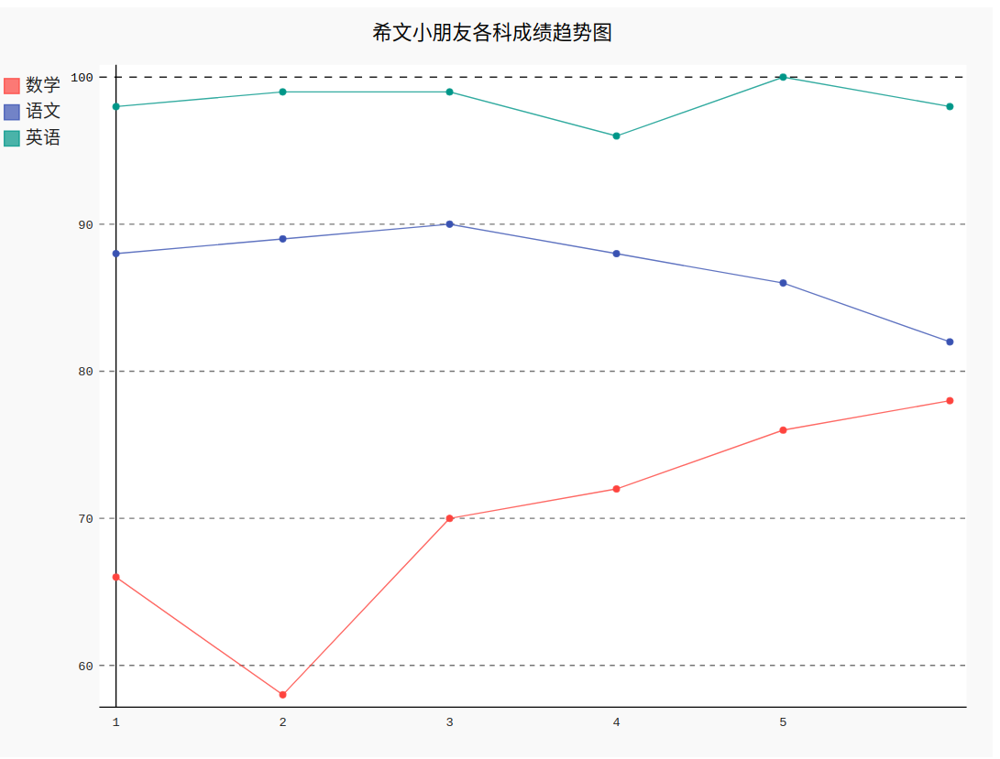

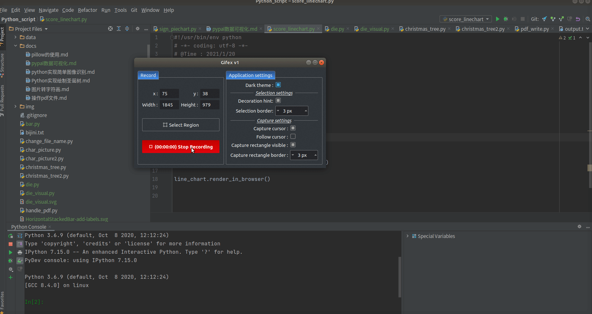

### 实例三
`die.py`

创建骰子类 
```python
from random import randint


class Die():
    """
    表示一个骰子的类
    """

    def __init__(self, num_sides=6):
        """骰子默认6面"""
        self.num_sides = num_sides

    def roll(self):
        """返回一个位于1和骰子面数之间的随机值"""
        return randint(1, self.num_sides)

```
`die_visual.py`
掷骰子

```python
#!/usr/bin/env python
# -*- coding: utf-8 -*-
# @Time : 2021/1/21
# @Author : AlexZ33
# @Site : 
# @File : die_visual.py
# @Software: PyCharm
from die import Die
import pygal
#创建一个D6
die = Die()

#掷几次骰子 并将结果存储在一个列表中
# 掷1000次
results = []
for roll_num in range(1000):
    result = die.roll()
    results.append(result)


frequencies = []
#分析结果
# 范围1~6，统计每个数字出现的次数
for value in range(1,die.num_sides+1):
    frequency = results.count(value)
    frequencies.append(frequency)


#对结果进行可视化
# 条形图
hist = pygal.Bar()
hist.title = "掷骰子1000次6个面的出现次数"
# x轴坐标
hist.x_labels = ['1','2','3','4','5','6']
# x、y轴的描述
hist.x_title = "结果面"
hist.y_title = "次数"
# 添加数据， 第一个参数是数据的标题
hist.add("D6",frequencies)

# hist.render_to_file("die_visual.svg")

# hist.render_to_png("die_visual.png")
# 使用浏览器打开
hist.render_in_browser()
```
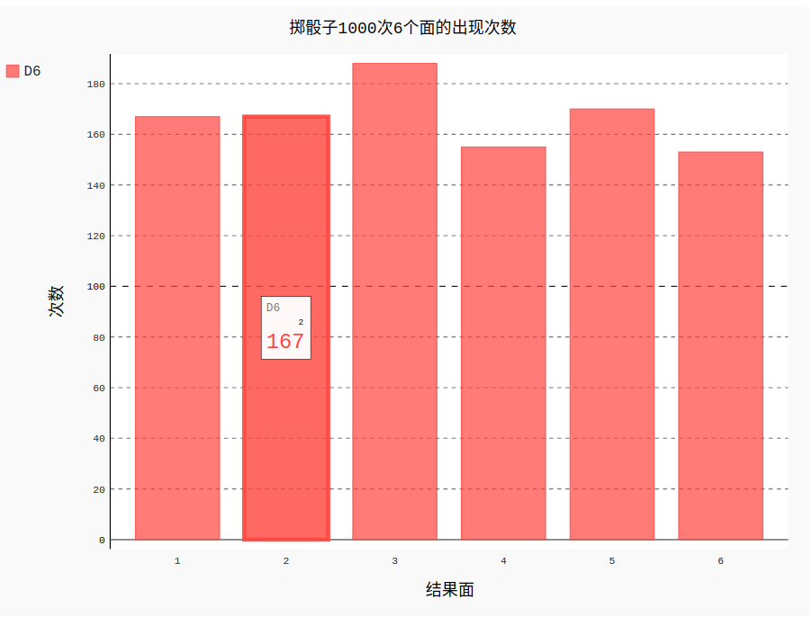
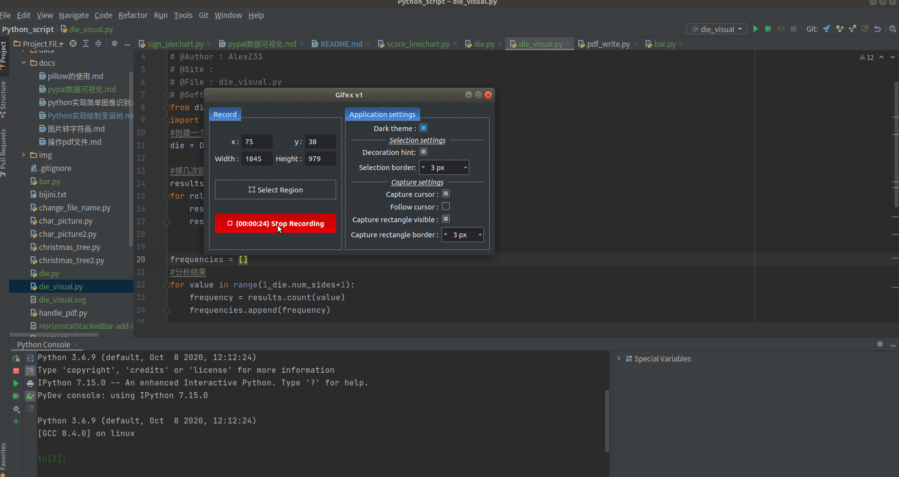

### 实例四

`restaurant_radar.py`
```python
import pygal
radar_chart = pygal.Radar()
radar_chart.title = '餐厅评分数据'
radar_chart.x_labels = ['味道', '卫生', '服务', '价格', '环境']
radar_chart.add('老王炸鸡', [9, 6, 6, 4, 7])
radar_chart.add('小明快餐', [7, 8, 9, 6, 8])
radar_chart.add('阿强烧烤', [10, 4, 6, 8, 4])
radar_chart.add('萌仔汉堡', [7, 6, 5, 4, 6])
radar_chart.render_in_browser()
```

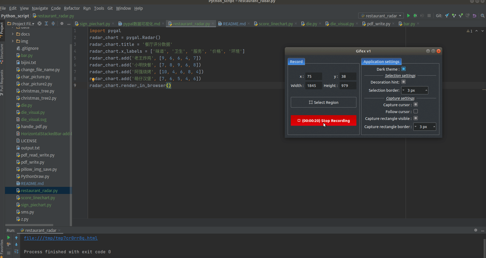

### 实例五
<b>可视化展示世界人口地图（处理json数据）</b>
需要用到人口数据 `population.json`, 它是json数据表示的。
在鲸鱼的源码仓库 data文件夹可以找到
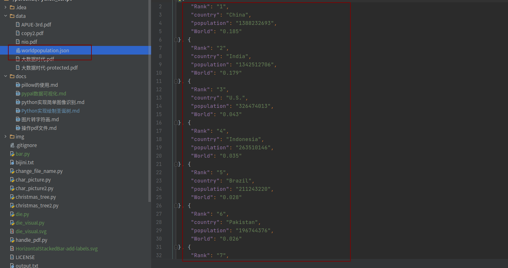

打开看下数据，其实这是个很长的列表，包含了许多国家从1960~2015年的人口数据。看第一数据，如下，后面的数据和第一个键都一样。
```json
{
 "Country Name":"Arab World",
 "Country Code":"ARB",
 "Year":"1960",
 "Value":"92496099"
 },
```

包含4个`key: value`键-值 对， 其中Country Code指的是国别码，这里是3位的。Value就是人口数了。

```python
#!/usr/bin/env python
# -*- coding: utf-8 -*-
# @Time : 2021/1/22
# @Author : AlexZ33
# @Site : 
# @File : world_population_map.py
# @Software: PyCharm

import json
import os

path = os.getcwd()
filename = path + '/data/worldpopulation.json'

with open(filename) as f:
    # json.load()可以将json文件转为Python能处理的形式，这里位列表，列表里是字典
    pop_data = json.load(f)

cc_population = {}
for pop_dict in pop_data:  # 将每个字典(上面解释的用大括号包裹的4个键值对)存储在pop_dict中
    if pop_dict['Year'] == '2010':  # for循环是一次操作一个值
        country_name = pop_dict['Country Name']
        # 有些值是小数，先转为float再转为int
        population = int(float(pop_dict['Value']))
        print(country_name + ': ', population)
```

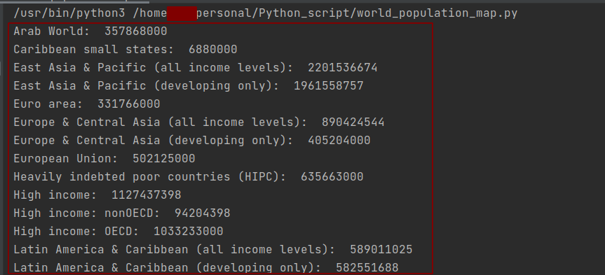

需要注意的是，人口数据有些值是小数（不可思议）。人口数据类型是字符串str，如果直接转int，像'35435.12432'这样的字符串是不能强转位int的，必须先转为float，再丢失精度转为int。

<b>获取两个字母的国别码</b>

我们的数据中，国别码是三位的，而pygal的地图工具使用两位国别码。要使用pygal绘制世界地图。需要安装依赖包。

`pip3 install pygal_maps_world`就可以了

国别码位于`i18n`模块

`from pygal_maps_world.i18n import COUNTRIES`这样就导入了, `COUNTRIES`是一个字典，键是两位国别码，值是具体国家名。

```json
key -> value
af Afghanistan
af Afghanistan
al Albania
al Albania
dz Algeria
dz Algeria
ad Andorra
ad Andorra
ao Angola
```
写一个函数，根据具体国家名返回pygal提供的两位国别码
```python
def get_country_code(country_name):
    """
    根据国家名返回两位国别码
    """
    for code, name in COUNTRIES.items():
        if name == country_name:
            return code
    return None
```

<b>世界人口地图绘制</b>

先给出全部代码，需要用到World类
```python
#!/usr/bin/env python
# -*- coding: utf-8 -*-
# @Time : 2021/1/22
# @Author : AlexZ33
# @Site : 
# @File : world_population_map.py
# @Software: PyCharm

import json
import os
from country_codes import get_country_code
from pygal_maps_world.maps import World
# 颜色相关
from pygal.style import RotateStyle,LightColorizedStyle


path = os.getcwd()
filename = path + '/data/worldpopulation.json'

with open(filename) as f:
    # json.load()可以将json文件转为Python能处理的形式，这里位列表，列表里是字典
    pop_data = json.load(f)

cc_populations = {}
for pop_dict in pop_data:  # 将每个字典(上面解释的用大括号包裹的4个键值对)存储在pop_dict中
    if pop_dict['Year'] == '2010':  # for循环是一次操作一个值
        country_name = pop_dict['Country Name']
        # 有些值是小数，先转为float再转为int
        population = int(float(pop_dict['Value']))
        code = get_country_code(country_name)
        print(country_name + ': ', population)
        if code:
            cc_populations[code] = population          #字典的赋值
        else:
            print("ERROR"+":"+country_name)
# 为了使颜色分层更加明显
cc_populations_1, cc_populations_2, cc_populations_3 = {}, {}, {}
for cc, population in cc_populations.items():
    if population < 10000000:
        cc_populations_1[cc] = population
    elif population < 1000000000:
        cc_populations_2[cc] = population
    else:
        cc_populations_3[cc] = population

wm_style = RotateStyle('#336699', base_style=LightColorizedStyle)
world = World(style=wm_style)
world.title = 'World Populations in 2010, By Country'
world.add('0-10m', cc_populations_1)
world.add('10m-1bn', cc_populations_2)
world.add('>1bn', cc_populations_3)
world.render_to_file('world_population_2010.svg')
world.render_in_browser()
```
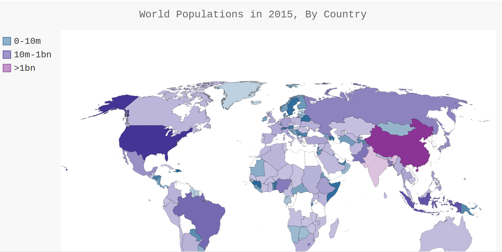


有几个变量比较重要

- cc_populations是一个dict，里面存放了两位国别码与人口的键值对。
- cc_populations_1,cc_populations_2, cc_populations_3这是3个字典，把人口按照数量分阶梯，人口一千万以下的存放在cc_populations_1中，一千万~十亿级别的存放在cc_populations_2中，十亿以上的存放在cc_populations_3中，这样做的目的是使得颜色分层更加明显，更方便找出各个阶梯里人口最多的国家。由于分了三个层次，在添加数据的的时候也add三次，把这三个字典分别传进去。
- world = World(style=wm_style)这是一个地图类，导入方法from pygal_maps_world.maps import World
- wm_style = RotateStyle('#336699', base_style=LightColorizedStyle)这里修改了pygal默认的主题颜色，第一个参数是16进制的RGB颜色，前两位代表R，中间两位代表G，最后两位代表B。数字越大颜色越深。第二个参数设置基础样式为亮色主题，pygal默认使用较暗的颜色主题，通过此方法可以修改默认样式。

<b>中国大佬，No. 1</b>

图中可以看出，分的三个颜色层次为。紫色系，十亿以上；蓝色系，一千万到十亿之间；绿色系，一千万一下。这三种颜色里面颜色最深的就对应了三个阶梯里人口最多的国家。

仔细观察，图中有些是空白的。并不是这些地方全部没人，而是我们的json数据中有些国家的名称与pygal中COUNTIES模块的国家名不对应导致。这算是一个遗憾，不过可以修改get_country_code函数，使得遇到不对应的国家名时，不返回None。对于这些国家，查阅COUNTRIES的代码，找出对应的国别码，返回之，应该就Ok了。比如下面这样

```python
# 传入的参数country_name是json数据中的，可能与COUNTRIES里面的国家名不一致，按照上面的代码直接就返回None，导致绘图时这个国家的人口数据空白
if country_name == 'Yemen, Rep':
    return 'ye'
```

#### 实例六
<b>使用Web API分析数据</b>
以GitHub为例，我想查看最受欢迎的Python库。以stars排序。

我们将创建一个交互式条形图：条形的高度表示项目获得了多少颗星

访问这个网址就可查看。数据大概长这样: 
- 网址： https://api.github.com/search/repositories?q=language:python

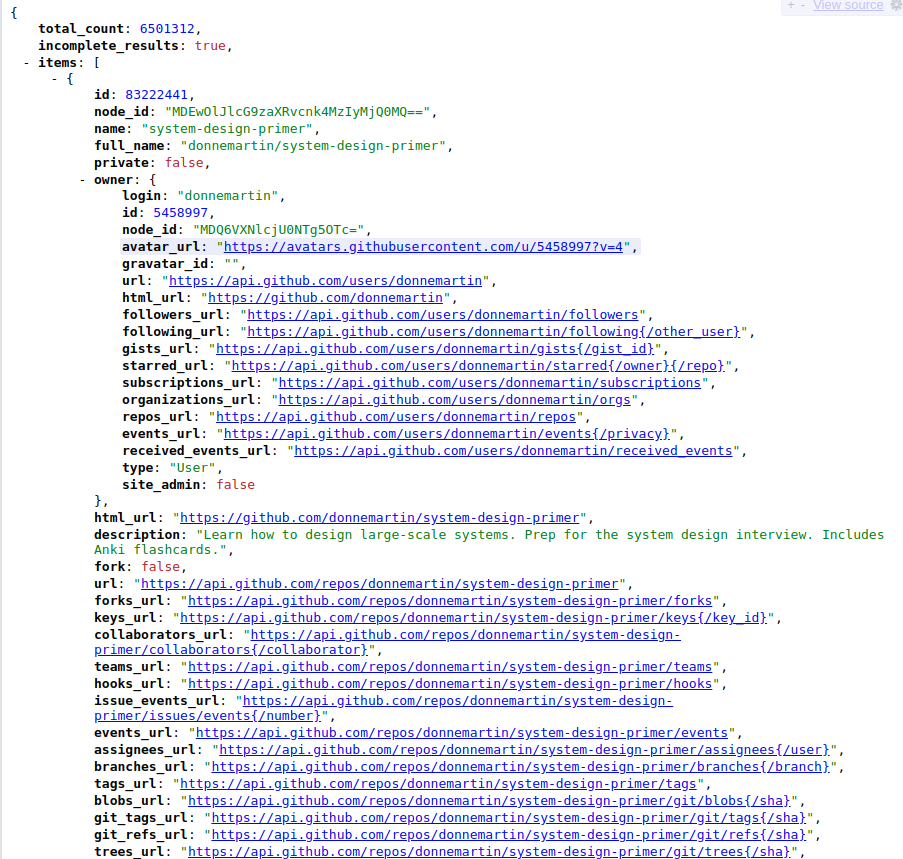

第三个数据，items。里面是得到stars最多的top 30。name即库名称，owner下的login是库的拥有者，html_url是该库的网址（注意owner下也有个html_url。不过那个是用户的GitHub网址，我们要定位到该用户的具体这个库，所以不要用owner下的html_url），stargazers_count至关重要，所得的stars数目。

顺便说下第一个键total_count，表示Python语言的仓库的总数；第二个键，incomplete_results，表示响应的值不完全，一般来说是false，表示响应的数据完整。

```python
import requests

url = 'https://api.github.com/search/repositories?q=language:python&sort=stars'
response = requests.get(url)
# 200为响应成功
print(response.status_code, '响应成功！')
response_dict = response.json()

total_repo = response_dict['total_count']
repo_list = response_dict['items']
print('总仓库数: ', total_repo)
print('top', len(repo_list))
for repo_dict in repo_list:
    print('\nName: ', repo_dict['name'])
    print('Owner: ', repo_dict['owner']['login'])
    print('Stars: ', repo_dict['stargazers_count'])
    print('Repo: ', repo_dict['html_url'])
    print('Description: ', repo_dict['description'])
```

其实像这样已经得到结果了
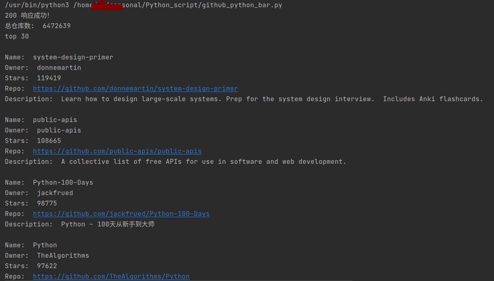


可视化一下当然会更加直观。

<b>pygal可视化数据</b>

代码不是很难，有一个plot_dict比较关键，这是鼠标放在条形图上时，会显示出来的数据，键基本上都是固定写法，xlink里面时仓库地址，只要点击，浏览器就会新开一个标签跳转到该页面了！

```python
#!/usr/bin/env python
# -*- coding: utf-8 -*-
# @Time : 2021/1/25
# @Author : AlexZ33
# @Site : 
# @File : github_python_bar.py
# @Software: PyCharm
import requests

import pygal
from pygal.style import LightColorizedStyle, LightenStyle

url = 'https://api.github.com/search/repositories?q=language:python&sort=stars'
response = requests.get(url)
# 200为响应成功
print(response.status_code, '响应成功！')
response_dict = response.json()

total_repo = response_dict['total_count']
repo_list = response_dict['items']
print('总仓库数: ', total_repo)
print('top', len(repo_list))

# 在图表中添加可单击的链接
# 在为每个项目创建的字典中，只需添加一个键为’xlink’的键-值对
names, plot_dicts = [], []
for repo_dict in repo_list:
    names.append(repo_dict['name'])
    # 加上str强转，因为我遇到了'NoneType' object is not subscriptable (: 说明里面有个没有此项, 是NoneType
    plot_dict = {
        'value': repo_dict['stargazers_count'],
        # 有些描述很长很长，选最前一部分
        'label': str(repo_dict['description'])[:200] + '...',
        'xlink': repo_dict['html_url']
    }
    plot_dicts.append(plot_dict)

# 改变默认主题颜色，偏蓝色
my_style = LightenStyle('#333366', base_style=LightColorizedStyle)
# 配置: 我们创建了一个Pygal类Config实例，命名为my_config
my_config = pygal.Config()
# 在这个图表中，副标签是x轴上的项目名&y轴上的大部分数字
# x轴的文字旋转45度
my_config.x_label_rotation = -45
# 隐藏左上角的图例
my_config.show_legend = False
# 标题字体大小
my_config.title_font_size = 30
# 副标签，包括x轴和y轴大部分
my_config.label_font_size = 20
# 主标签是y轴某数倍数，相当于一个特殊的刻度，让关键数据点更醒目
# 这些刻度应更大，以与副标签区分开
my_config.major_label_font_size = 24
# 限制字符为15个，超出的以...显示
# truncate_label将较长的项目名缩短为15个字符（如果将鼠标指向被截短的项目名，将显示完整的项目名）
my_config.truncate_label = 15
# 不显示y参考虚线
# show_y_guides=False以隐藏图表中的水平线
my_config.show_y_guides = False
# 图表宽度
# 最后自定义了宽度，让图表更充分地利用浏览器地可用空间
my_config.width = 1000

# 第一个参数可以传配置
chart = pygal.Bar(my_config, style=my_style)
chart.title = 'Most-Starred Python Projects on GitHub'
# x轴的数据
chart.x_labels = names
# 加入y轴的数据，无需title设置为空，注意这里传入的字典，
# 其中的键--value也就是y轴的坐标值了
chart.add('', plot_dicts)
chart.render_to_file('most_stars_python_repo.svg')
chart.render_in_browser()
```
看下图，chrome浏览器里显示效果。总感觉config里面有些设置没有起到作用, x、y轴的标签还是那么小orz...不过plot_dict里面的三个数据都显示出来了，点击即可跳转。

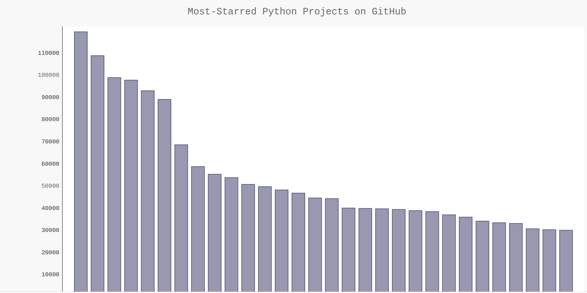


本章完，对python技术栈感兴趣的同学可以关注下面的公众号。

# 联系我们
