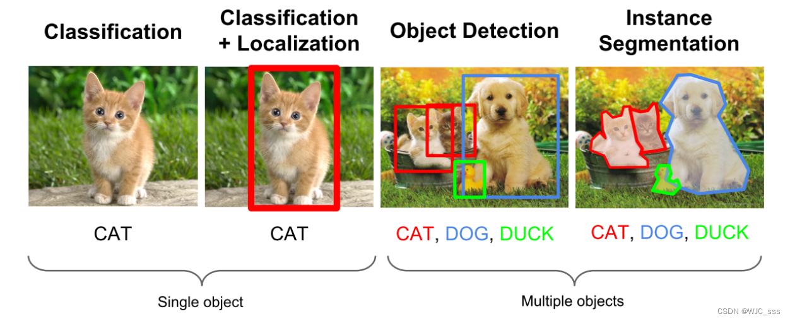
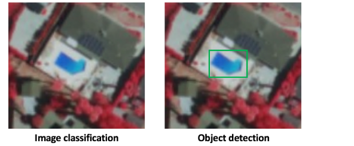
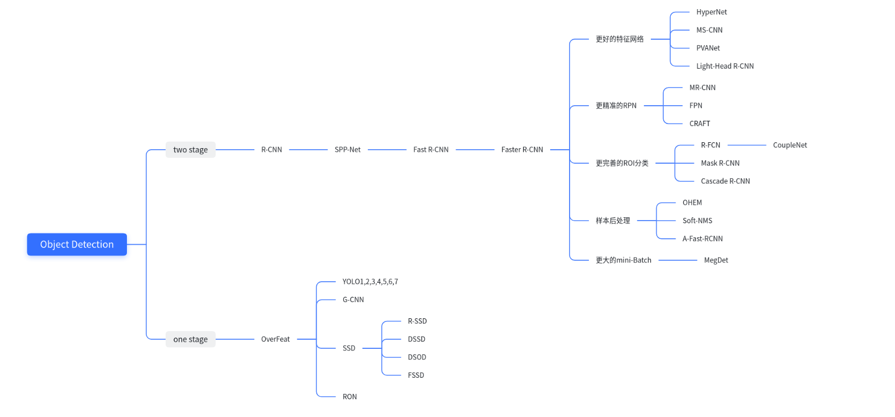
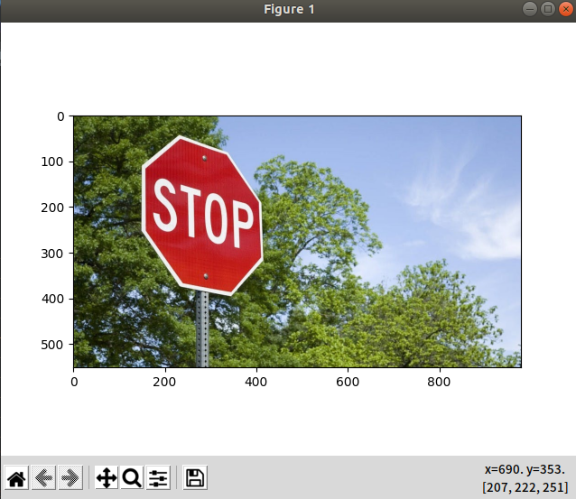
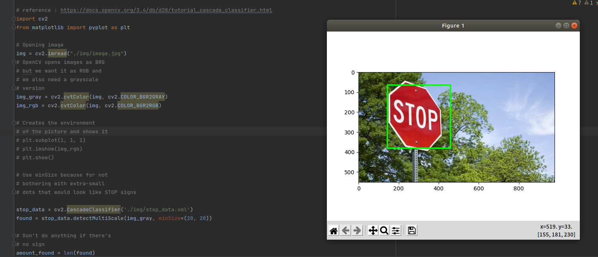
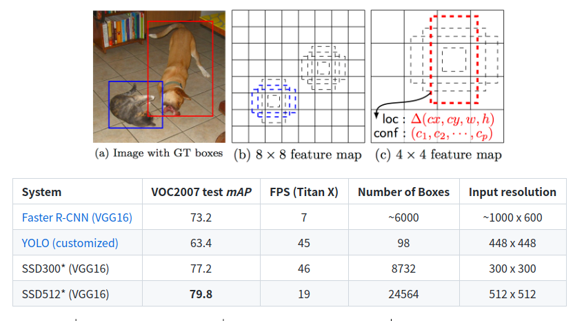

OpenCV 是用于计算机视觉、机器学习和图像处理的庞大开源库，现在它在实时操作中发挥着重要作用，这在当今的系统中非常重要
通过使用它，人们可以处理图像和视频以识别物体、面部，甚至是人类的笔迹。本文重点介绍检测对象。

# Object Detection
对象检测是一种与计算机视觉、图像处理和深度学习相关的计算机技术，用于检测图像和视频中的对象实例

目标检测算法的任务是找出图像中所有感兴趣的目标（物体），确定他们的类别和位置。



计算机视觉中的图像分类获取图像并预测图像中的对象，而对象检测不仅可以预测对象，还可以根据边界框找到它们的位置。 例如，当我们构建游泳池分类器时，我们获取输入图像并预测它是否包含游泳池，而对象检测模型也会告诉我们游泳池的位置。



> 1. 分类和物体检测的区别?

假设图像中最多有一个类和一个对象，那么对象检测模型的输出应该包括：

- 存在物体的概率
- 边界框的高度
- 边界框的宽度
- <b>边界框中心点</b>的水平坐标
- 边界框中心点的纵坐标
这只是指定输出的约定之一,不同的模型和实现可能有不同的格式，但是思路是一样的，都是输出物体的概率和位置。

>2.为什么滑动窗口方法不起作用?
很自然地想到在图像分类模型之上构建对象检测模型。一旦我们有了一个好的图像分类器，检测对象的一种简单方法是在图像上滑动一个“窗口”，然后对该窗口中的图像（图像的裁剪区域）是否属于所需类型进行分类。
听起来很简单！好吧，至少有两个问题：

- 您如何知道窗口的大小以使其始终包含对象？不同类型的对象（棕榈树和游泳池），即使是相同类型的对象（例如小型建筑物和大型建筑物）也可以具有不同的大小。
- 纵横比（边界框的高宽比）。许多物体可以以各种形状存在，例如建筑物的占地面积与棕榈树的纵横比不同。
为了解决这些问题，我们必须尝试不同大小/形状的滑动窗口，这是非常计算密集的，尤其是对于深度神经网络。


在实践中，主流的目标检测算法有两种:
## Two stage目标检测算法
> 首先识别预计会找到对象的区域，然后使用卷积网络仅在这些区域中检测对象。
- 先进行区域生成（region proposal,RP）(一个可能包含待检测物体的预选框)，再通过卷积神经网络进行样本分类。
- 任务：特征提取->生成RP->分类/定位回归。
- 常见Two stage目标检测算法有:R-CNN、SPP-Net、Fast R-CNN和R-FCN等。
##  One stage 目标检测算法

> 另一方面，像 YOLO（You Only Look Once）[1] 和 SSD（Single-Shot Detector）[2] 等算法使用完全卷积的方法，其中网络能够一次找到图像中的所有对象（ 因此通过卷积网络“单次拍摄”或“看一次”
- 不用RP，直接在网络中提取特征来预测物体分类和位置。
- 任务：特征提取->分类/定位回归。
- 常见的one stage目标检测算法有：OverFeat、YOLOv1、YOLOv3、SSD和RetinaNet等。



# Haar Cascades
Opening an image
```python
import cv2
from matplotlib import pyplot as plt


# Opening image
img = cv2.imread("image.jpg")

# OpenCV opens images as BRG
# but we want it as RGB and
# we also need a grayscale
# version
img_gray = cv2.cvtColor(img, cv2.COLOR_BGR2GRAY)
img_rgb = cv2.cvtColor(img, cv2.COLOR_BGR2RGB)

# Creates the environment
# of the picture and shows it
plt.subplot(1, 1, 1)
plt.imshow(img_rgb)
plt.show()

```



Recognition
我们将使用 OpenCV 的 detectMultiScale() 函数来识别大符号和小符号：

```python
# Use minSize because for not 
# bothering with extra-small 
# dots that would look like STOP signs
found = stop_data.detectMultiScale(img_gray, 
                                   minSize =(20, 20))
  
# Don't do anything if there's 
# no sign
amount_found = len(found)
  
  
if amount_found != 0:
      
    # There may be more than one
    # sign in the image
    for (x, y, width, height) in found:
          
        # We draw a green rectangle around
        # every recognized sign
        cv2.rectangle(img_rgb, (x, y), 
                      (x + height, y + width), 
                      (0, 255, 0), 5)
```


```python
import cv2
from matplotlib import pyplot as plt

# Opening image
img = cv2.imread("image.jpg")

# OpenCV opens images as BRG
# but we want it as RGB We'll
# also need a grayscale version
img_gray = cv2.cvtColor(img, cv2.COLOR_BGR2GRAY)
img_rgb = cv2.cvtColor(img, cv2.COLOR_BGR2RGB)


# Use minSize because for not
# bothering with extra-small
# dots that would look like STOP signs
stop_data = cv2.CascadeClassifier('stop_data.xml')

found = stop_data.detectMultiScale(img_gray,
								minSize =(20, 20))

# Don't do anything if there's
# no sign
amount_found = len(found)

if amount_found != 0:
	
	# There may be more than one
	# sign in the image
	for (x, y, width, height) in found:
		
		# We draw a green rectangle around
		# every recognized sign
		cv2.rectangle(img_rgb, (x, y),
					(x + height, y + width),
					(0, 255, 0), 5)
		
# Creates the environment of
# the picture and shows it
plt.subplot(1, 1, 1)
plt.imshow(img_rgb)
plt.show()

```


<br></br>

**ps: 我们假设您对卷积神经网络 (CNN) 概念有一些基本了解。 您可以通过阅读这篇简短的论文“深度学习卷积算法指南”来更新您的 CNN 知识**
# SSD 
SSD 是一个统一的单一网络目标检测框架。


# RetinaNet
RetinaNet 是最好的单阶段目标检测模型之一，已被证明可以很好地处理密集和小规模目标。因此，它已成为一种流行的对象检测模型，可用于航空和卫星图像。


# R-CNN
# yolo
# Reference
- [A guide to convolution arithmetic for deep learning](https://arxiv.org/pdf/1603.07285.pdf)
- [Fast R-CNN](https://arxiv.org/abs/1504.08083)
- [Rapid Object Detection using a Boosted Cascade of Simple Features](https://www.researchgate.net/publication/3940582_Rapid_Object_Detection_using_a_Boosted_Cascade_of_Simple_Features)
- [Computer Vision and Pattern Recognition/SSD: Single Shot MultiBox Detector](https://arxiv.org/abs/1512.02325)
  - code : https://github.com/weiliu89/caffe/tree/ssd
  - PPT : http://www.cs.unc.edu/~wliu/papers/ssd_eccv2016_slide.pdf
- [RetinaNet/ Focal Loss for Dense Object Detection](https://arxiv.org/abs/1708.02002)
  - code : https://github.com/facebookresearch/Detectron

- [opencv cascade classifier training](https://docs.opencv.org/3.4/db/d28/tutorial_cascade_classifier.html)
