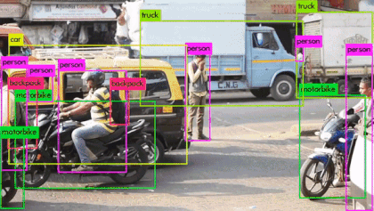

OpenCV 是用于计算机视觉、机器学习和图像处理的庞大开源库，现在它在实时操作中发挥着重要作用，这在当今的系统中非常重要
通过使用它，人们可以处理图像和视频以识别物体、面部，甚至是人类的笔迹。本文重点介绍检测对象。

# Object Detection
对象检测是一种与计算机视觉、图像处理和深度学习相关的计算机技术，用于检测图像和视频中的对象实例

目标检测算法的任务是找出图像中所有感兴趣的目标（物体），确定他们的类别和位置。


计算机视觉中的图像分类获取图像并预测图像中的对象，而对象检测不仅可以预测对象，还可以根据边界框找到它们的位置。 例如，当我们构建游泳池分类器时，我们获取输入图像并预测它是否包含游泳池，而对象检测模型也会告诉我们游泳池的位置。


> 1. 分类和物体检测的区别?

假设图像中最多有一个类和一个对象，那么对象检测模型的输出应该包括：

- 存在物体的概率
- 边界框的高度
- 边界框的宽度
- <b>边界框中心点</b>的水平坐标
- 边界框中心点的纵坐标
这只是指定输出的约定之一,不同的模型和实现可能有不同的格式，但是思路是一样的，都是输出物体的概率和位置。

>2.为什么滑动窗口方法不起作用?
很自然地想到在图像分类模型之上构建对象检测模型。一旦我们有了一个好的图像分类器，检测对象的一种简单方法是在图像上滑动一个“窗口”，然后对该窗口中的图像（图像的裁剪区域）是否属于所需类型进行分类。
听起来很简单！好吧，至少有两个问题：

- 您如何知道窗口的大小以使其始终包含对象？不同类型的对象（棕榈树和游泳池），即使是相同类型的对象（例如小型建筑物和大型建筑物）也可以具有不同的大小。
- 纵横比（边界框的高宽比）。许多物体可以以各种形状存在，例如建筑物的占地面积与棕榈树的纵横比不同。
为了解决这些问题，我们必须尝试不同大小/形状的滑动窗口，这是非常计算密集的，尤其是对于深度神经网络。


在实践中，主流的目标检测算法有两种:
## Two stage目标检测算法
> 首先识别预计会找到对象的区域，然后使用卷积网络仅在这些区域中检测对象。
- 先进行区域生成（region proposal,RP）(一个可能包含待检测物体的预选框)，再通过卷积神经网络进行样本分类。
- 任务：特征提取->生成RP->分类/定位回归。
- 常见Two stage目标检测算法有:R-CNN、SPP-Net、Fast R-CNN和R-FCN等。
##  One stage 目标检测算法

> 另一方面，像 YOLO（You Only Look Once）[1] 和 SSD（Single-Shot Detector）[2] 等算法使用完全卷积的方法，其中网络能够一次找到图像中的所有对象（ 因此通过卷积网络“单次拍摄”或“看一次”
- 不用RP，直接在网络中提取特征来预测物体分类和位置。
- 任务：特征提取->分类/定位回归。
- 常见的one stage目标检测算法有：OverFeat、YOLOv1、YOLOv3、SSD和RetinaNet等。


# Haar Cascades
Haar特征选择
类似 Haar 的特征由暗区和亮区组成。 它通过取暗区域强度之和与亮区域强度之和的差来产生单个值。 这样做是为了提取识别对象所需的有用元素。 viola 和 jones 提出的特征是：


- **创建积分图像(Integral Images)**
  - 积分图像中的给定像素是左侧所有像素及其上方所有像素的总和,由于提取 Haar-like 特征的过程涉及计算暗矩形区域和亮矩形区域的差异,积分图像的引入显着减少了完成此任务所需的时间
- AdaBoost Training
  - 该算法从所有特征中选择最佳特征,它将多个“弱分类器”（最佳特征）组合成一个“强分类器”,生成的“强分类器”基本上是所有“弱分类器”的线性组合。
- 级联分类器(Cascade Classifier)
  -  它是一种将越来越复杂的分类器（如 AdaBoost）组合在级联中的方法，它允许快速丢弃负输入（非人脸），同时在有希望或正人脸区域上花费更多计算。
  - 它显着减少了计算时间并提高了处理效率。

### example 1
Opening an image
```python
import cv2
from matplotlib import pyplot as plt


# Opening image
img = cv2.imread("image.jpg")

# OpenCV opens images as BRG
# but we want it as RGB and
# we also need a grayscale
# version
img_gray = cv2.cvtColor(img, cv2.COLOR_BGR2GRAY)
img_rgb = cv2.cvtColor(img, cv2.COLOR_BGR2RGB)

# Creates the environment
# of the picture and shows it
plt.subplot(1, 1, 1)
plt.imshow(img_rgb)
plt.show()

```


Recognition
我们将使用 OpenCV 的 detectMultiScale() 函数来识别大符号和小符号：


```python
# Use minSize because for not 
# bothering with extra-small 
# dots that would look like STOP signs
found = stop_data.detectMultiScale(img_gray, 
                                   minSize =(20, 20))
  
# Don't do anything if there's 
# no sign
amount_found = len(found)
  
  
if amount_found != 0:
      
    # There may be more than one
    # sign in the image
    for (x, y, width, height) in found:
          
        # We draw a green rectangle around
        # every recognized sign
        cv2.rectangle(img_rgb, (x, y), 
                      (x + height, y + width), 
                      (0, 255, 0), 5)
```


```python
import cv2
from matplotlib import pyplot as plt

# Opening image
img = cv2.imread("image.jpg")

# OpenCV opens images as BRG
# but we want it as RGB We'll
# also need a grayscale version
img_gray = cv2.cvtColor(img, cv2.COLOR_BGR2GRAY)
img_rgb = cv2.cvtColor(img, cv2.COLOR_BGR2RGB)


# Use minSize because for not
# bothering with extra-small
# dots that would look like STOP signs
stop_data = cv2.CascadeClassifier('stop_data.xml')

found = stop_data.detectMultiScale(img_gray,
								minSize =(20, 20))

# Don't do anything if there's
# no sign
amount_found = len(found)

if amount_found != 0:
	
	# There may be more than one
	# sign in the image
	for (x, y, width, height) in found:
		
		# We draw a green rectangle around
		# every recognized sign
		cv2.rectangle(img_rgb, (x, y),
					(x + height, y + width),
					(0, 255, 0), 5)
		
# Creates the environment of
# the picture and shows it
plt.subplot(1, 1, 1)
plt.imshow(img_rgb)
plt.show()

```


### example 2

OpenCV 带有许多预训练的分类器。这些 XML 文件可以通过 cv2 模块的 cascadeClassifier 方法加载。在这里，我们将使用 haarcascade_frontalface_default.xml 来检测人脸。

```python
import cv2
from matplotlib import pyplot as plt

# loading the image
img = cv2.imread("./img/footballteam.png")

# converting the image to grayscale
# 最初，图像是三层图像（即RGB），因此将其转换为一层图像（即灰度）。
gray_img = cv2.cvtColor(img, cv2.COLOR_BGR2GRAY)

# 加载所需的 haar-cascade XML 分类器文件
# cv2模块中的CascadeClassifier方法支持加载haar-cascade XML文件
# 要“haarcascade_frontalface_default.xml”进行人脸检测。
haar_cascade = cv2.CascadeClassifier("./img/haarcascade_frontalface_default.xml")

# Applying the face detection method on the grayscale image
#在灰度图像上应用人脸检测方法
# 这是使用 cv2::CascadeClassifier::detectMultiScale 方法完成的，该方法返回检测到的人脸的边界矩形（即 x、y、w、h）。
#  它有两个参数，即 scaleFactor 和 minNeighbors。 ScaleFactor 确定窗口大小的增加因子，最初从大小“minSize”开始，
# 并且在测试了该大小的所有窗口之后，窗口被“scaleFactor”放大，窗口大小上升到“maxSize”。
# 如果“scaleFactor”很大，（例如，2.0），步骤会更少，所以检测会更快，但我们可能会错过大小在两个测试尺度之间的对象。 （默认比例因子为 1.3）。
# “minNeighbors”的值越高，误报的数量就越少，在人脸错误检测方面的错误也就越少。 但是，也有可能遗漏一些不清楚的面部痕迹。

faces_rect = haar_cascade.detectMultiScale(gray_img, scaleFactor=1.1, minNeighbors=9)

# Iterating through rectangles of detected faces
# 遍历检测到的人脸的矩形
# 通过 cv2 模块的 rectangle 方法通过迭代所有检测到的人脸，在检测到的人脸周围绘制矩形。

for (x, y, w, h) in faces_rect:
    cv2.rectangle(img, (x, y), (x + w, y + h), (0, 255, 0), thickness=2)

cv2.imshow('Detected faces', img)
cv2.waitKey(0)

plt.subplot(1, 1, 1)
plt.imshow(img)
plt.show()


```
input:

output:


<br></br>

**ps: 我们假设您对卷积神经网络 (CNN) 概念有一些基本了解。 您可以通过阅读这篇简短的论文“深度学习卷积算法指南”来更新您的 CNN 知识**
# SSD 
SSD 是一个统一的单一网络目标检测框架。


# RetinaNet
RetinaNet 是最好的单阶段目标检测模型之一，已被证明可以很好地处理密集和小规模目标。因此，它已成为一种流行的对象检测模型，可用于航空和卫星图像。


# R-CNN

R-CNN（具有卷积神经网络的区域）架构是多种算法的组合。 它首先使用选择搜索算法来选择 2000 个可能包含对象的区域建议。 这些区域提议或感兴趣区域（RoI）中的每一个都通过卷积网络进行处理以获得特征图。 然后将特征图传递给 SVM 模型以对对象类进行分类，并传递给回归模型以获得紧密的边界框 [2]。 这种方法在当时虽然新颖，但速度极慢

1.  预训练模型。选择一个预训练模型（pre-trained）神经网络(如AlexNet、VGG)。 
2.  重新训练全连接层使用需要检测的目标重新训练(re-train)最后全连接层(connected layer)。 
3.  提取prosals并计算 CNN 特征。利用选择性搜索(Slective Search)算法提取所有prosals（大约2000幅images）,调整(resize/warp)它们固定大小，以满足CNN输入，然后将feature map 保存到本地磁盘。 
4.  训练 SVM 。利用feature map 训练SVM来对目标和背景进行分类(每个类一个二进制SVM）。 
5.  边界框回归(Bounding boxes Regression)。训练将输出一些校正因子的线性回归分类器。 


# Fast-rcnn
1. 将原图上的提议框按照几何比例缩放到特征图上
2. 利用RoI Pooling将不同尺寸的特征图变换到相同大小
3. 最后基于相同尺寸的特征图进行分类和回归。
Fast R-CNN 是对 R-CNN 的改进。 在这个模型中，不是将 2000 个区域中的每一个都输入到单独的 CNN 中，而是将整个图像输入到单个 CNN 中。 这导致所有感兴趣区域的组合特征图。 使用类似于 R-CNN 中使用的算法来选择区域建议。 一个 RoI 池化层用于提取所有候选区域的特征图并将其调整为相同大小。 然后将其传递到具有两个分支的全连接层 - 一个 softmax 分类器为每个类提供概率，一个边界框回归器用于精确的边界框坐标 [3]。 与 R-CNN 相比，这种设计加快了目标检测任务，但仍不足以处理大型数据集。

# Faster R-CNN

在 Faster R-CNN 出现之前，它的同时代人一直在使用各种算法进行区域提议，这些算法在 CPU 上进行计算并造成瓶颈。 Faster R-CNN 通过将 Fast R-CNN 中的选择搜索算法替换为称为区域提议网络 (RPN) 的卷积网络来改进对象检测架构。 模型架构的其余部分与 Fast R-CNN 相同——图像被馈送到 CNN 以生成特征图，RPN 提出的区域的特征从中被选择并由池化层调整大小并馈送到 FC 层 有两个头，一个softmax分类器和一个边界框回归器。 这种设计提高了检测速度并使其更接近实时

1. 输入、数据预处理。首先，假设样本图片image，尺寸大小Q×P，将其输入Faster-RCNN网络，然后进行resize操作，处理图片的尺寸到H×W，适应模型要求。
2. Conv layers（backbone提取特征）。Faster-RCNN可以采用多种的主干特征提取网络，常用的有VGG，Resnet，Xception等等。该feature maps被共享用于后续RPN层和全连接层。也就是使用共享的卷积层为全图提取特征。
3. Region Proposal Networks。RPN网络用于生成region proposals(目标候选区域)。将RPN生成的候选框投影到特征图上获得相应的特征矩阵。该层通过softmax判断anchors(锚)属于前景或者背景，再利用bounding box regression修正anchors获得精确的proposals。
4. RoI Pooling。该层收集输入的feature maps和proposals，将每个特征矩阵缩放到7×7大小的特征图，综合这些信息后提取proposal 和feature maps，送入后续全连接层判定目标类别。
5. Classifier。通过全连接层得到最后的概率，计算得到类别，同时再次bounding box regression获得检测框最终的精确位置。尤其注意的是，Faster R-CNN真正实现了端到端的训练(end-to-end training)。
# Mask R-CNN

# yolo
YOLO（You Only Look Once）是最受欢迎的对象检测模型系列之一。它的优势在于提供实时检测，同时接近最先进的对象检测模型的准确性。
在早期的目标检测工作中，模型要么使用滑动窗口技术，要么使用区域提议网络。滑动窗口，顾名思义，通过在图像上滑动窗口来选择感兴趣区域 (RoI)，然后在所选 RoI 中执行分类以检测对象。区域提议网络分两步工作——首先，它们提取区域提议，然后使用 CNN 特征对提议的区域进行分类。滑动窗口方法不是很精确和准确，尽管一些基于区域的网络可以非常准确，但它们往往速度较慢。随后出现了 SSD、YOLO 和 RetinaNet 等一次性目标检测器。这些模型在图像的单次通过中检测对象，因此速度更快，并且可以匹配基于区域的检测器的准确性。 SSD 指南解释了一次性目标检测模型的基本组成部分。您还可以在此处阅读 RetinaNet 指南。这些模型已经是 ArcGIS API for Python 的一部分，并且 YOLOv3 的添加在我们的深度学习工具箱中提供了另一个工具。 arcgis.learn 中 YOLOv3 的最大优势在于它预加载了在 COCO 数据集上预训练的权重。这使得它可以立即用于作为 COCO 数据集一部分的 80 个常见对象（汽车、卡车、人等）



# Reference
- [A guide to convolution arithmetic for deep learning](https://arxiv.org/pdf/1603.07285.pdf)
- [Fast R-CNN](https://arxiv.org/abs/1504.08083)
- [Rapid Object Detection using a Boosted Cascade of Simple Features](https://www.researchgate.net/publication/3940582_Rapid_Object_Detection_using_a_Boosted_Cascade_of_Simple_Features)
- [Computer Vision and Pattern Recognition/SSD: Single Shot MultiBox Detector](https://arxiv.org/abs/1512.02325)
  - code : https://github.com/weiliu89/caffe/tree/ssd
  - PPT : http://www.cs.unc.edu/~wliu/papers/ssd_eccv2016_slide.pdf
- [RetinaNet/ Focal Loss for Dense Object Detection](https://arxiv.org/abs/1708.02002)
  - code : https://github.com/facebookresearch/Detectron
- [YOLOv3 Object Detector](https://developers.arcgis.com/python/guide/yolov3-object-detector/)
- [You Only Look Once: Unified, Real-Time Object Detection](https://arxiv.org/abs/1506.02640)
- [YOLO9000: Better, Faster, Stronger](https://arxiv.org/abs/1612.08242)
- [Rich feature hierarchies for accurate object detection and semantic segmentation](https://arxiv.org/abs/1311.2524)
- [Fast R-CNN](https://arxiv.org/abs/1504.08083)
- [Towards Real-Time Object Detection with Region Proposal Networks](https://arxiv.org/abs/1506.01497)
- [darknet](https://pjreddie.com/darknet/yolov1/)
- [opencv cascade classifier training](https://docs.opencv.org/3.4/db/d28/tutorial_cascade_classifier.html)
- [Faster R-CNN Object Detector](https://developers.arcgis.com/python/guide/faster-rcnn-object-detector/)
- [一文读懂Faster RCNN](https://zhuanlan.zhihu.com/p/31426458)
- [目标检测之Faster R-CNN](https://zhuanlan.zhihu.com/p/518741727)
- [Faster R-CNN详解](https://blog.csdn.net/zhangyuexiang123/article/details/108255901)
  - code: https://github.com/rbgirshick/py-faster-rcnn
- [Faster R-CNN: Towards Real-Time Object Detection with Region Proposal Networks](https://papers.nips.cc/paper/2015/file/14bfa6bb14875e45bba028a21ed38046-Paper.pdf)