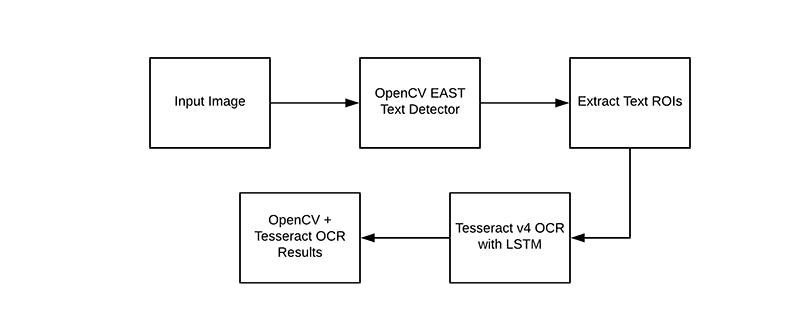
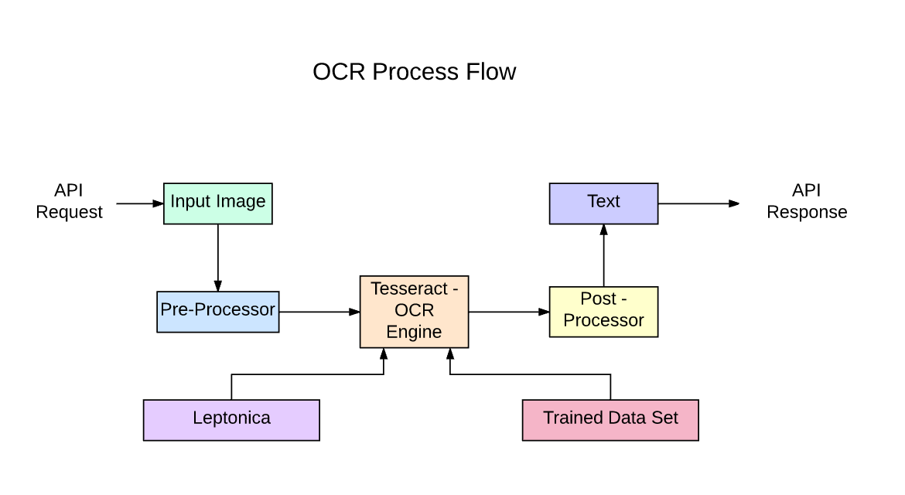

# OpenCV OCR 和 Tesseract 文本识别
本教程介绍了如何使用 Python+ OpenCv + OCR 将图像转换为文本。其中包括为 python 安装 opencv，安装和配置 tesseract ocr。

  - Tesseract OCR Features
  - 使用 OpenCV 对 OCR 进行预处理
  - 运行 Tesseract
  - Tesseract 引擎的局限性


# 介绍
OCR = 光学字符识别。 换句话说，OCR 系统将文本的二维图像（可能包含机器打印或手写的文本）从其图像表示转换为机器可读的文本。 OCR 作为一个过程通常由几个子过程组成，以尽可能准确地执行。 子流程是：

近二十年来，光学字符识别系统已被广泛用于向计算机化系统提供自动文本输入。 然而，在这段时间里，传统的在线 OCR 系统（如区域 OCR）从未克服过无法读取超过少数类型字体和页面格式的问题。 等距字体（包括几乎所有的排版副本）、激光打印机字体，甚至许多非比例打字机字体，仍然超出了这些系统的范围。 因此，传统的 OCR 对需要转换为数字形式的文档总数的影响从未超过边际影响。

下一代 OCR 引擎利用**深度学习**领域的最新研究，很好地解决了上述这些问题。 通过利用深度模型和公开可用的大量数据集的组合，模型在给定任务上实现了最先进的准确性。 如今，还可以使用**生成对抗网络**和其他一些生成方法来生成具有不同字体的合成数据。

当文本出现在不受约束的环境（如自然场景）中时，由于几何扭曲、复杂的背景和不同的字体，字符识别仍然是一个具有挑战性的问题。 由于基于深度学习的 OCR 的各种用例，该技术仍然具有巨大的潜力，例如
建造车牌阅读器,数字化发票,数字化菜单,数字化身份证

# Tesseract OCR


- OpenCV 旨在为计算机视觉应用程序提供通用基础架构，并加速机器感知在商业产品中的使用。
  - OpenCV（开源计算机视觉）是一个主要针对实时计算机视觉的编程函数库。
  - Python中的OpenCV有助于处理图像并应用各种功能，如调整图像大小、像素操作、对象检测等。在本文中，我们将学习如何使用轮廓来检测图像中的文本并将其保存到文本文件中
- Tesseract 是适用于各种操作系统的光学字符识别引擎,自 2006 年以来一直由 Google 赞助开发。Tesseract 被认为是目前可用的最准确的开源 OCR 引擎之一


是一个开源文本识别 (OCR) 引擎，可在 Apache 2.0 许可下使用。 它可以直接使用，或者（对于程序员）使用 API 从图像中提取打印文本。 它支持多种语言。
它可以与现有的布局分析一起使用以识别大型文档中的文本，也可以与外部文本检测器结合使用以从单个文本行的**图像中识别文本**()。




`Tesseract 4.00` 包括一个配置为文本行识别器的新神经网络子系统。 它起源于 `OCRopus` 的基于 Python 的 LSTM 实现，但已针对 C 中的 Tesseract 进行了重新设计。 Tesseract 中的神经网络系统早于 TensorFlow，但与之兼容，因为有一种称为可变图规范语言 (VGSL) 的网络描述语言，也可用于 TensorFlow。

为了识别包含单个字符的图像，我们通常使用卷积神经网络 (CNN)。 任意长度的文本是一个字符序列，使用 RNN 可以解决此类问题，而 LSTM 是 RNN 的一种流行形式。


# LSTM
LSTM的全称是Long Short Term Memory，顾名思义，它具有记忆长短期信息的能力的神经网络。LSTM首先在1997年由Hochreiter & Schmidhuber [1] 提出，由于深度学习在2012年的兴起，LSTM又经过了若干代大牛(Felix Gers, Fred Cummins, Santiago Fernandez, Justin Bayer, Daan Wierstra, Julian Togelius, Faustino Gomez, Matteo Gagliolo, and Alex Gloves)的发展，由此便形成了比较系统且完整的LSTM框架，并且在很多领域得到了广泛的应用

LSTM 非常擅长学习序列，但当状态数量过多时会减慢很多。 有经验结果表明，让 LSTM 学习长序列比学习许多类的短序列更好。
Tesseract 是从 Python 中的 OCRopus 模型开发的，它是 C 中 LSMT 的一个分支，称为 CLSTM。 CLSTM 是 C 语言中 LSTM 循环神经网络模型的实现，使用 Eigen 库进行数值计算。


On Linux

```bash
sudo apt-get update
sudo apt-get install libleptonica-dev 
sudo apt-get install tesseract-ocr tesseract-ocr-dev
sudo apt-get install libtesseract-dev
```

On Mac
```bash
brew install tesseract
```

On Windows
download binary from https://github.com/UB-Mannheim/tesseract/wiki. 
then add `pytesseract.pytesseract.tesseract_cmd = 'C:\Program Files (x86)\Tesseract-OCR\tesseract.exe' `to your script.

```bash
pip install tesseract
pip install tesseract-ocr
```
references: https://pypi.org/project/pytesseract/ (INSTALLATION section) and https://github.com/tesseract-ocr/tesseract/wiki#installation


<b>np.one()</b>
```

>>> np.ones(5)
array([1., 1., 1., 1., 1.])

>>> np.ones((5,), dtype=int)
array([1, 1, 1, 1, 1])

>>> np.ones((2, 1))
array([[1.],
       [1.]])

>>> s = (2,2)
>>> np.ones(s)
array([[1.,  1.],
       [1.,  1.]])

```


# Reference
- [Long short-term memory](http://www.bioinf.jku.at/publications/older/2604.pdf)
- Paper: [Reading Text in the Wild with Convolutional Neural Networks](https://arxiv.org/abs/1412.1842)
- [OpenCV OCR and text recognition with Tesseract](https://pyimagesearch.com/2018/09/17/opencv-ocr-and-text-recognition-with-tesseract/) 
- [基于CNN的端到端文字检测与识别](https://zhuanlan.zhihu.com/p/43295656)

