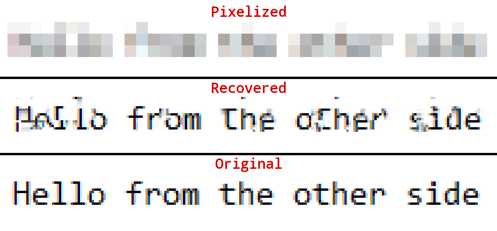

GitHub上发现了一个名为 Depix的项目，截止目前已经8.4k的Star了。简介中说道：

Depix is a tool for recovering passwords from pixelized screenshots.
Depix是一个从像素化的截图中恢复密码的工具。

​ 说白了就是利用深度学习恢复被打马赛克的文字。
先看效果：

可以看到虽然没有完全恢复，但是基本也可以看出原图的文字了。由于线性盒式滤波是确定性算法，因此将相同的值进行像素化将始终导致相同的像素化块。 使用块的相同位置对相同文本进行像素化将产生相同的块值。 我们可以尝试对文本进行像素化以找到匹配的模式。 采用的解决方案就是：生成德布鲁因序列，将生成的序列粘贴到同一编辑器中，并进行截图。 该截图用作类似块的查找图像。

# 低通盒式滤波器

