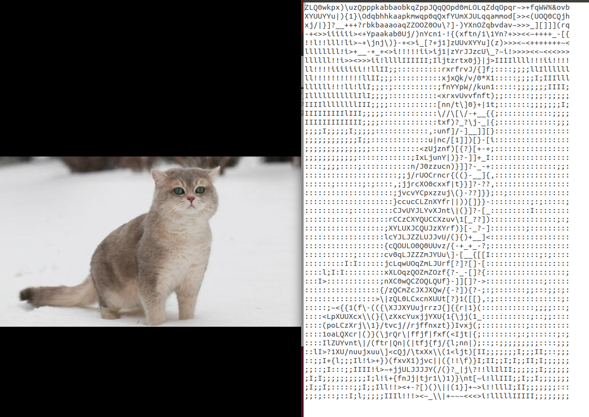
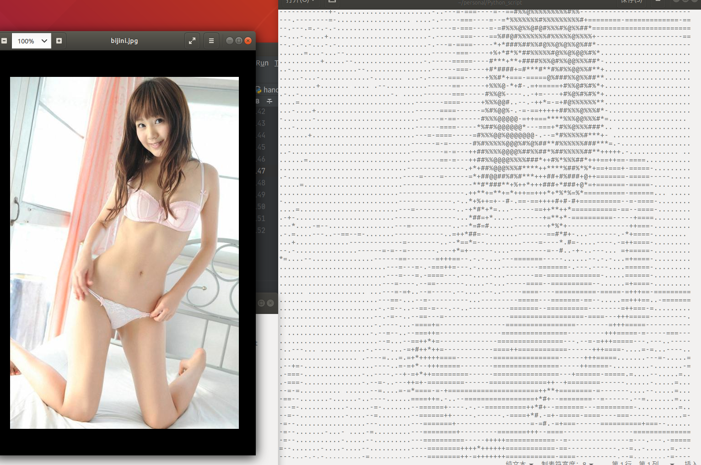
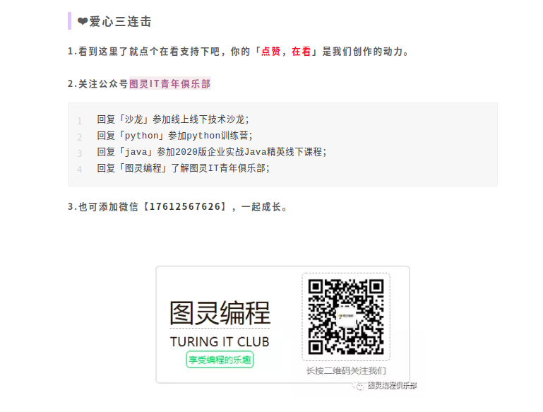

# 图片转字符画

**面向人群**: 零基础或者初学者

**难度**: 简单， 属于Python基础课程

## 重要说明
我们尽力保证课程内容的质量以及学习难度的合理性，但即使如此，真正决定课程效果的，还是你的每一次思考和实践。

课程多数题目的解决方案都不是唯一的，这和我们在实际工作中的情况也是一致的。因此，我们的要求功能的实现，更是要多去思考不同的解决方案，评估不同方案的优劣，然后使用在该场景下最优雅的方式去实现。所以，我们列出的参考资料未必是实现需求所必须的。有的时候，实现题目的要求很简单，甚至参考资料里就有，但是背后的思考和亲手去实践却是任务最关键的一部分。在学习这些资料时，要多思考，多提问，多质疑。相信通过和小伙伴们的交流，能让你的学习事半功倍。
## 1.1 任务介绍
Python实现图片转换为字符画。用Python将彩色的图片经过一系列的操作后，可以变为全是由字符组成的字符画，最后可以输出为txt文件。txt文件可以用文本打开，放大或缩小查看。
## 1.2 知识点
- Linux命令行的使用
- Python基础
- pillow库的使用
- argparse库的使用(参考教程)
## 1.3 环境
- linux系统(ubuntu18.04)/ windows系统可以打开ubuntu子系统
- pycharm编辑器(windows如何安装pycharm社区版本)
- Python 3.6.9(windows如何安装python环境)
- pip3 9.0.1
- pillow 5.1.0

```
$ python --version
Python 3.6.9

$ pip3 --version
pip 9.0.1 from /usr/lib/python3/dist-packages (python 3.6)

```
PIL(pillow)是一个Python图像处理库，使用下面的命令来安装pillow（PIL）库：

> 注意: Pillow是Python里的图像处理库，是PIL派生的一个分支，主要用来替换PIL库。这是因为PIL只支持Python2的版本；而在Python3中使用的则是Pillow。
> 大概是PIL low的意思 


windows系统：
- （1）Win+R，输入cmd，打开Windows的命令行。
- （2）输入：pip install pillow，等待安装完成。
如果安装过程不顺利，请百度找到原因，直到安装成功为止

linux系统：
```bash
sudo pip3 install --upgrade pip
sudo pip3 install pillow
```

# 1.4 原理

字符画是一系列字符的组合，我们可以把字符看作是比较大块的像素，一个字符能表现一种颜色，字符的种类越多，可以表现的颜色也越多，图片也会更有层次感。

最终显示的是黑白色的字符画，那么彩色的图片怎么转换成黑白的呢？这里就需要了解灰度值的概念了。
```html
<span style="font-size:16px;">灰度值：指黑白图像中点的颜色深度，范围一般从0到255，白色为255，黑色为0，故黑白图片也称灰度图像。</span>
```

我们利用下面的公式将像素的RGB值转换成灰度值：
```html
<span style="color:#ff0000;">gray ＝ 0.2126 * r + 0.7152 * g + 0.0722 * b</span>
```

用不同的字符代表不同的灰度值，字符的种类和数量可以根据自己需要的效果进行调整，最好从前往后可以看到明显的变化，最后一个字符为空格符最佳：
```html
ascii_char = list("$@B%8&WM#*oahkbdpqwmZO0QLCJUYXzcvunxrjft/\|()1{}[]?-_+~<>i!lI;:,\"^`'. ")
```

图片转字符画的关键思想是将图片的灰度值与你自己设定的字符集之间建立映射关系，不同区间的灰度值对应不同的字符，之后将图片每一个像素对应的字符打印出来就是我们要的字符画啦~
这里提供两种方法：


- （示例1）获取图片的RGB值，利用公式：
Gray = R*0.299 + G*0.587 + B*0.114
计算可得每个像素点的灰度值，之后再建立映射即可。

- （示例2）先将彩色图片转换为黑白图片，然后直接将每个像素点的灰度值与字符集建立映射。

# 1.5 代码

示例1： `char_picture.py`

```python
#!/usr/bin/env python
# -*- coding: utf-8 -*-
# @Time : 2020/12/1
# @Author : AlexZ33
# @Site : 
# @File : char_picture.py
# @description: Python实现图片转换为字符画。用Python将彩色的图片经过一系列的操作后，可以变为全是由字符组成的字符画，最后可以输出为txt文件。txt文件可以用文本打开，放大或缩小查看。
# @Software: PyCharm

from PIL import Image

IMG = "./img/cat.jpg"

WIDTH = 60
HEIGHT = 45

#生成字符画所需的字符集
ascii_char = list("$@B%8&WM#*oahkbdpqwmZO0QLCJUYXzcvunxrjft/\|()1{}[]?-_+~<>i!lI;:,\"^`'. ")


# 将256灰度映射到70个字符上
def get_char(r, g, b, alpha=256):  # alpha透明度
    if alpha == 0:
        return ' '
    length = len(ascii_char)
    gray = int(0.2126 * r + 0.7152 * g + 0.0722 * b)  # 计算灰度
    unit = (256.0 + 1) / length
    return ascii_char[int(gray / unit)]  # 不同的灰度对应着不同的字符
    # 通过灰度来区分色块


if __name__ == '__main__':
    im = Image.open(IMG)
    im = im.resize((WIDTH, HEIGHT), Image.NEAREST)
    txt = ""
    for i in range(HEIGHT):
        for j in range(WIDTH):
            txt += get_char(*im.getpixel((j, i)))
        txt += '\n'
    print(txt)
    # 写入文件
    with open("output.txt",'w') as f:
        f.write(txt)


```
结果：



示例2： `char_picture2.py`

```python
#!/usr/bin/env python
# -*- coding: utf-8 -*-
# @Time : 2020/12/1
# @Author : AlexZ33
# @Site : 
# @File : char_picture2.py
# @Software: PyCharm
from PIL import Image
img = Image.open("./img/bijini.jpg") # 打开
# img = Image.open("./img/cat.jpg") # 打开

#转换为黑白图片，参数"L"表示黑白模式
out = img.convert("L") # 灰度  先将彩色图片转换为黑白图片
width, height = out.size # 赋值
out = out.resize((int(width * 0.2),int(height * 0.1))) # 改变图像的大小
width, height = out.size # 赋值

#生成字符画所需的字符集
asciis = "@%#*+=-. "
texts  = ""
for row in range(height):
    for col in range(width):
        gray = out.getpixel((col,row))
        texts += asciis[int(gray / 255 * 8)]
    texts += "\n"
with open("bijini.txt","w") as file:
    file.write(texts)
```
结果：



# 1.6 详情解读

阅读[pillow的使用.md](./docs/pillow的使用.md)

# 联系我们
