# 【Python教程】PyPDF2处理PDF文件
> 实际应用中，可能会涉及处理 pdf 文件，PyPDF2 就是这样一个库，使用它可以轻松的处理 pdf 文件，它提供了读，割，合并，文件转换等多种操作。

> 文档地址：http://pythonhosted.org/PyPDF2/

# PyPDF2 安装
PyCharm 安装：File -> Default Settings -> Project Interpreter

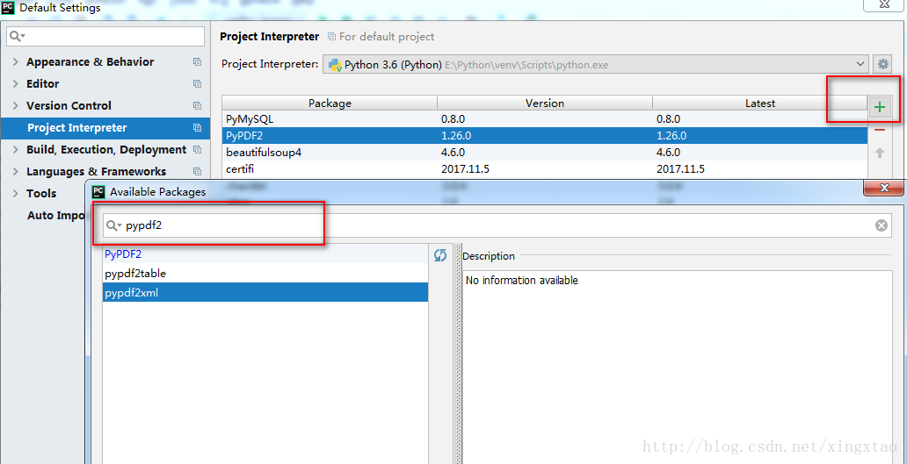

# PdfFileReader
构造方法：
```python
PyPDF2.PdfFileReader(stream,strict = True,warndest = None,overwriteWarnings = True)
```

初始化一个 PdfFileReader 对象，此操作可能需要一些时间，因为 PDF 流的交叉引用表被读入内存。

参数：

- stream：*File 对象或支持与 File 对象类似的标准读取和查找方法的对象，也可以是表示 PDF 文件路径的字符串。
- *strict（bool）： 确定是否应该警告用户所用的问题，也导致一些可纠正的问题是致命的，默认是 True
- warndest : 记录警告的目标(默认是 sys.stderr)
- overwriteWarnings(bool)：确定是否 warnings.py 用自定义实现覆盖 Python 模块（默认为 True）

**PdfFileReader 对象的属性和方法**
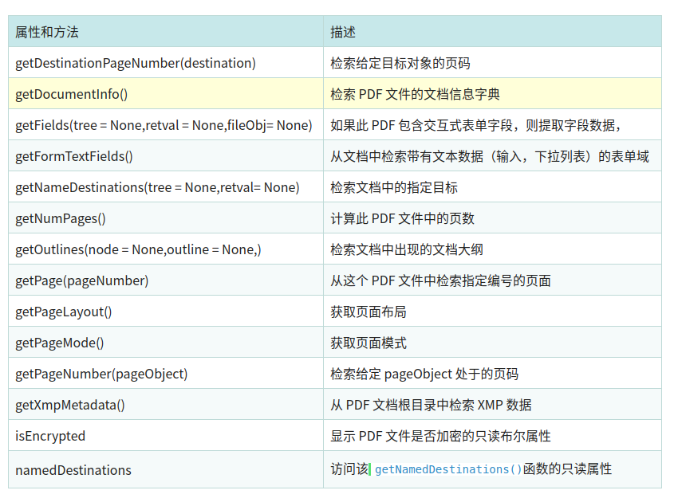


```python
# encoding:utf-8
from PyPDF2 import PdfFileReader, PdfFileWriter

readFile = './data/大数据时代.pdf'
readFile2 = './data/APUE-3rd.pdf'
# 获取 PdfFileReader 对象
pdfFileReader = PdfFileReader(readFile2)  # 或者这个方式：pdfFileReader = PdfFileReader(open(readFile, 'rb'))

# 获取 PDF 文件的文档信息
documentInfo = pdfFileReader.getDocumentInfo()
print('documentInfo = %s' % documentInfo)

# 获取页面布局
pageLayout = pdfFileReader.getPageLayout()
print('pageLayout = %s ' % pageLayout)

# 获取页模式
pageMode = pdfFileReader.getPageMode()
print('pageMode = %s' % pageMode)

xmpMetadata = pdfFileReader.getXmpMetadata()
print('xmpMetadata = %s ' % xmpMetadata)

# 获取 pdf 文件页数
pageCount = pdfFileReader.getNumPages()

print('pageCount = %s' % pageCount)

for index in range(0, pageCount):
    # 返回指定页编号的 pageObject
    pageObj = pdfFileReader.getPage(index)
    print('index = %d , pageObj = %s' % (index, type(pageObj)))  # <class 'PyPDF2.pdf.PageObject'>
    # 获取 pageObject 在 PDF 文档中处于的页码
    pageNumber = pdfFileReader.getPageNumber(pageObj)
    print('pageNumber = %s ' % pageNumber)


```

结果：

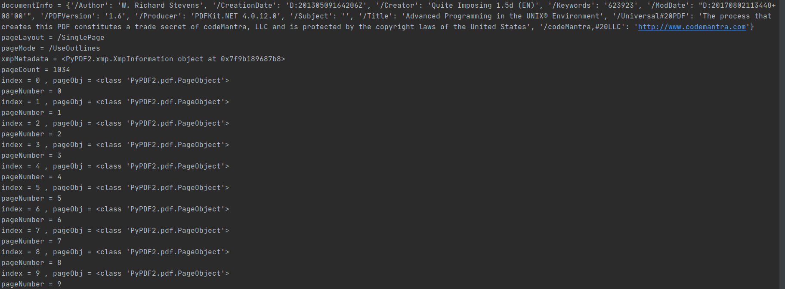

# PdfFileWriter
这个类支持 PDF 文件，给出其他类生成的页面。
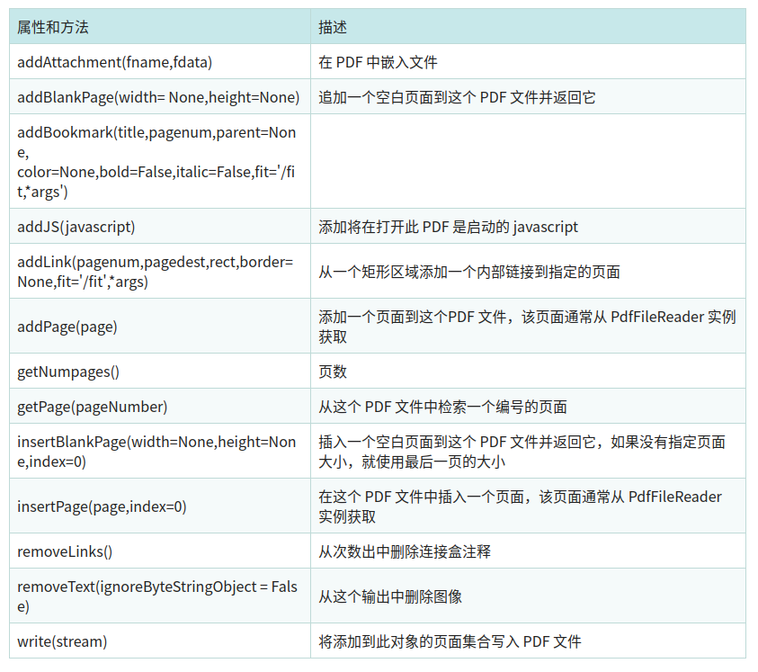

## PDF 写入操作：

```python
#!/usr/bin/env python
# -*- coding: utf-8 -*-
# @Time : 2020/11/26
# @Author : AlexZ33
# @Site : 
# @File : pdf_write.py.py
# @Software: PyCharm
from PyPDF2 import PdfFileReader, PdfFileWriter


def addBlankpage():
    # 注意下面是linux系统下的文件位置
    readFile = '/home/mi/personal/Python_script/data/nio.pdf'
    outFile = '/home/mi/personal/Python_script/data//copy2.pdf'
    # 注意下面是ｗｉｎｄｏｗｓ系统下的文件位置
    # readFile = 'C:/Users/Administrator/Desktop/RxJava 完全解析.pdf'
    # outFile = 'C:/Users/Administrator/Desktop/copy.pdf'

    pdfFileWriter = PdfFileWriter()

    # 获取 PdfFileReader 对象
    pdfFileReader = PdfFileReader(readFile)  # 或者这个方式：pdfFileReader = PdfFileReader(open(readFile, 'rb'))
    numPages = pdfFileReader.getNumPages()

    for index in range(0, numPages):
        pageObj = pdfFileReader.getPage(index)
        pdfFileWriter.addPage(pageObj)  # 根据每页返回的 PageObject,写入到文件
        pdfFileWriter.write(open(outFile, 'wb'))

    pdfFileWriter.addBlankPage()  # 在文件的最后一页写入一个空白页,保存至文件中
    pdfFileWriter.write(open(outFile, 'wb'))

# 注意此段代码文件过大时候无法写入
addBlankpage()


```
结果是：在写入的 copy.pdf 文档的最后最后一页写入了一个空白页。
注意此段代码文件过大时候无法写入
## 分割文档（取第五页之后的页面）

```python
def splitPdf():
  # 注意下面是linux系统下的文件位置
    readFile = '/home/mi/personal/Python_script/data/nio.pdf'
    outFile = '/home/mi/personal/Python_script/data//copy2.pdf'
    # 注意下面是ｗｉｎｄｏｗｓ系统下的文件位置
    # readFile = 'C:/Users/Administrator/Desktop/RxJava 完全解析.pdf'
    # outFile = 'C:/Users/Administrator/Desktop/copy.pdf'

  pdfFileWriter = PdfFileWriter()

  # 获取 PdfFileReader 对象
  pdfFileReader = PdfFileReader(readFile) # 或者这个方式：pdfFileReader = PdfFileReader(open(readFile, 'rb'))
  # 文档总页数
  numPages = pdfFileReader.getNumPages()

  if numPages > 5:
    # 从第五页之后的页面，输出到一个新的文件中，即分割文档
    for index in range(5, numPages):
      pageObj = pdfFileReader.getPage(index)
      pdfFileWriter.addPage(pageObj)
    # 添加完每页，再一起保存至文件中
    pdfFileWriter.write(open(outFile, 'wb'))
```

## 合并文档

```pyhon
def mergePdf(inFileList, outFile):
  '''
  合并文档
  :param inFileList: 要合并的文档的 list
  :param outFile:  合并后的输出文件
  :return:
  '''
  pdfFileWriter = PdfFileWriter()
  for inFile in inFileList:
    # 依次循环打开要合并文件
    pdfReader = PdfFileReader(open(inFile, 'rb'))
    numPages = pdfReader.getNumPages()
    for index in range(0, numPages):
      pageObj = pdfReader.getPage(index)
      pdfFileWriter.addPage(pageObj)

    # 最后,统一写入到输出文件中
    pdfFileWriter.write(open(outFile, 'wb'))

```
# PageObject

```python
PageObject(pdf=None,indirectRef=None)
```
此类表示 PDF 文件中的单个页面，通常这个对象是通过访问 PdfFileReader 对象的 getPage() 方法来得到的，也可以使用 createBlankPage() 静态方法创建一个空的页面。

参数：

- pdf : 页面所属的 PDF 文件。
- indirectRef：将源对象的原始间接引用存储在其源 PDF 中。

**PageObject 对象的属性和方法**

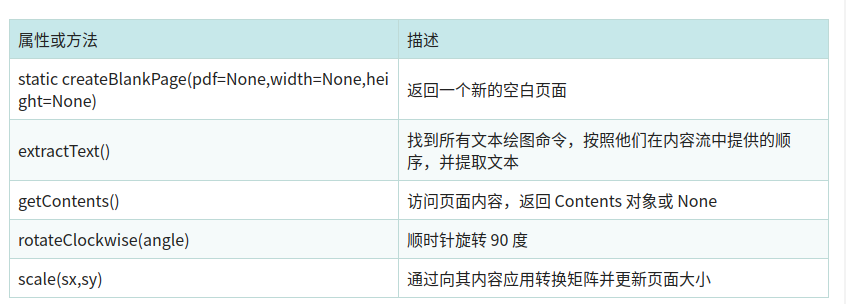

## 粗略读取 PDF 文本内容

```python
def getPdfContent(filename):
  pdf = PdfFileReader(open(filename, "rb"))
  content = ""
  for i in range(0, pdf.getNumPages()):
    pageObj = pdf.getPage(i)

    extractedText = pageObj.extractText()
    content += extractedText + "\n"
    # return content.encode("ascii", "ignore")
  return content
```

# 部分细致讲解
我们可以使用open( )打开PDF文件，语法如下：

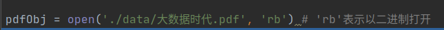

上述`'./data/大数据时代.pdf'`是要打开的文件路径，开档成功后会传回所打开PDF文件的文件对象

debug下，看看pdfObj是什么

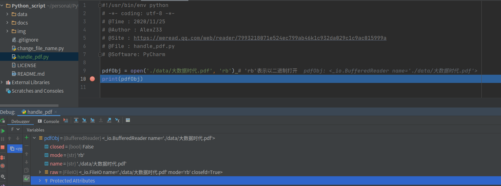

打开PDF文件成功后，可以使用PdfFileReader( )方法读取这个PDF文件，下列是语法内容：

```python
import PyPDF2
fn = './data/大数据时代.pdf' # 指定读取文件的路径
pdfObj = open(fn, 'rb') # 'rb'表示以二进制打开
print(pdfObj)

pdfRd = PyPDF2.PdfFileReader(pdfObj) # 读取pdf内容

print("PDF页数= ", pdfRd.numPages)
```

我们可以debug下看一看读取的pdf对象内容

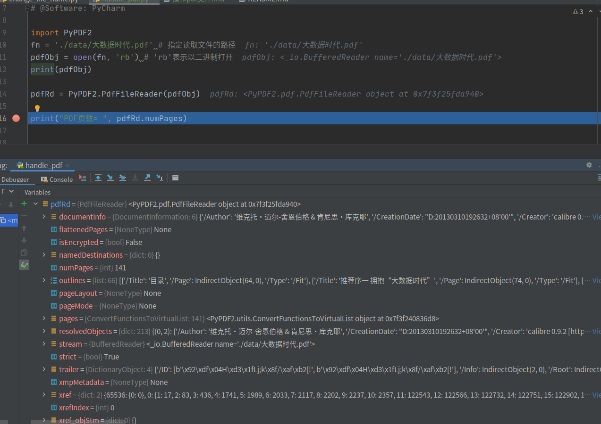

运行下程序，获得结果
读者可检查页面，这个PDF文件的确是141页。

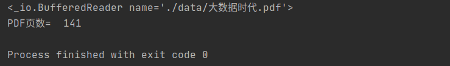

# 检查PDF是否被加密

初次执行“pdfRd = PyPDF2.PdfFileReader(pdfObj)”之后，pdfRd对象会有isEncryted属性，如果此属性是True，表示文件有加密。如果此属性是False，表示文件没有加密

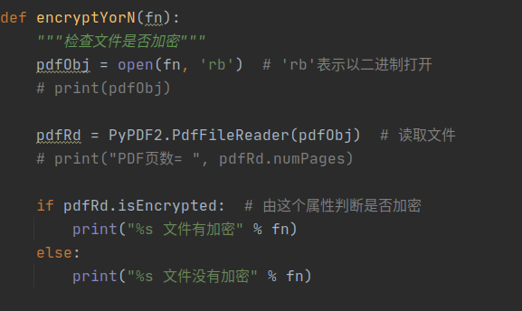
```python
import PyPDF2

fn = './data/大数据时代.pdf'  # 指定读取文件的路径
fn_protected = './data/大数据时代-protected.pdf'

# pageObj = pdfRd.getPage()  # 将第10页内容读入pageObj
# txt = pageObj.extractText()
# print(txt)

"""
检查PDF是否被加密
目录　./data/大数据时代.pdf　文件没有加密
目录

"""


def encryptYorN(fn):
    """检查文件是否加密"""
    pdfObj = open(fn, 'rb')  # 'rb'表示以二进制打开
    # print(pdfObj)

    pdfRd = PyPDF2.PdfFileReader(pdfObj)  # 读取文件
    # print("PDF页数= ", pdfRd.numPages)

    if pdfRd.isEncrypted:  # 由这个属性判断是否加密
        print("%s 文件有加密" % fn)
    else:
        print("%s 文件没有加密" % fn)


encryptYorN(fn)
encryptYorN(fn_protected )

```
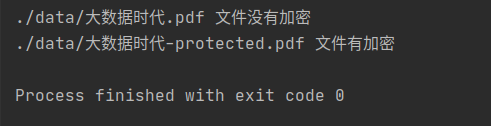

# decrypt( )执行解密
对于加密的PDF文件，我们可以使用decrypt( )执行解密，如果解密成功decrypt( )会传回1，如果失败则传回0。
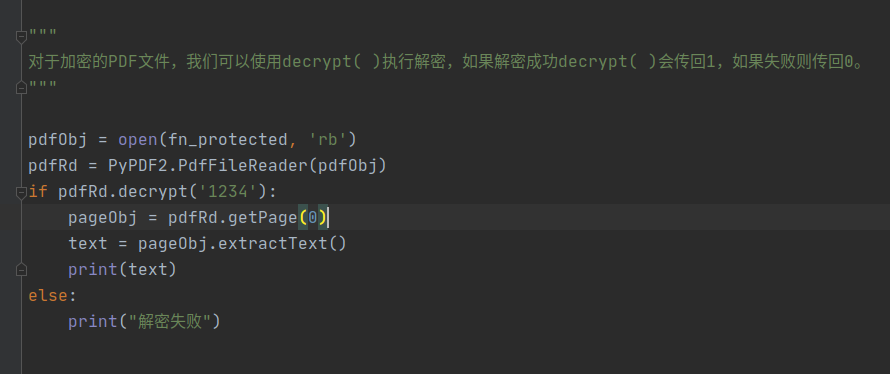

# 联系我们
