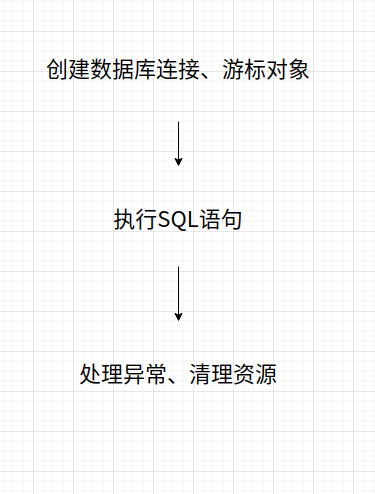

```python
webapp/   <-- 根目录
|
+- backup/               <-- 备份目录
|
+- conf/                 <-- 配置文件
|
+- dist/                 <-- 打包目录
|
+- www/                  <-- Web目录，存放.py文件
|  |
|  +- static/            <-- 存放静态文件
|  |
|  +- templates/         <-- 存放模板文件
|
+- LICENSE               <-- 代码LICENSE
```

# 编写数据库模块

Web App里面有很多地方都要访问数据库， 访问数据库需要


在一个Web App中，有多个用户会同时访问，系统以多进程或多线程模式来处理每个用户的请求。假设以多线程为例，每个线程在访问数据库时，都必须创建仅属于自身的连接，对别的线程不可见，否则，就会造成数据库操作混乱。
所以，我们还要创建一个简单可靠的数据库访问模型，在一个线程中，能既安全又简单地操作数据库。

##　设计db模型
设计一个封装基本的SELECT、INSERT、UPDATE和DELETE操作的db模块：transwarp.db。
# 